# Introduce
*This file generated by [@liang.faan](https://github.com/liang-faan/JavaDesignPattern) on April 11, 2021*

*Resources reference to [Design Patterns in Java](https://www.javatpoint.com/design-patterns-in-java) @ javapoint.com*

# Java Design Pattern
## 1. [Creational Design Pattern](#1-creational-design-pattern-1)
### 1.1 [Factory Pattern](#11-factory-pattern-1)
### 1.2 [Abstract Factory Pattern](#12-abstract-factory-pattern-1)
### 1.3 [Singleton Pattern](#13-singleton-pattern-1)
### 1.4 [Prototype Pattern](#14-prototype-pattern-1)
### 1.5 [Builder Pattern](#15-builder-pattern-1)
### 1.6 [Object Pool Pattern](#16-object-pool-pattern-1)
## 2. [Structural Design Pattern](#2-structural-design-pattern-1)
### 2.1 [Adapter Pattern](#21-adapter-pattern-1)
### 2.2 [Bridge Pattern](#22-bridge-pattern-1)
### 2.3 [Composite Pattern](#23-composite-pattern-1)
### 2.4 [Decorator Pattern](#24-decorator-pattern-1)
### 2.5 [Facade Pattern](#25-facade-pattern-1)
### 2.6 [Flyweight Pattern](#26-flyweight-pattern-1)
### 2.7 [Proxy Pattern](#27-proxy-pattern-1)
## 3. [Behavioral Design Pattern](#3-behavioral-design-pattern-1)
### 3.1 [Chain Of Responsibility Pattern](#31-chain-of-responsibility-pattern-1)
### 3.2 [Command Pattern](#32-command-pattern-1)
### 3.3 [Interpreter Pattern](#33-interpreter-pattern-1)
### 3.4 [Iterator Pattern](#34-iterator-pattern-1)
### 3.5 [Mediator Pattern](#35-mediator-pattern-1)
### 3.6 [Memento Pattern](#36-memento-pattern-1)
### 3.7 [Observer Pattern](#37-observer-pattern-1)
### 3.8 [State Pattern](#38-state-pattern-1)
### 3.9 [Strategy Pattern](#39-strategy-pattern-1)
### 3.10 [Template Pattern](#310-template-pattern-1)
### 3.11 [Visitor Pattern](#311-visitor-pattern-1)

## 1. Creational Design Pattern
Creational design patterns are concerned with the way of creating objects. These design patterns are used when a decision must be made at the time of instantiation of a class (i.e. creating an object of a class).

But everyone knows an object is created by using new keyword in java. For example:
```java
StudentRecord s1=new StudentRecord();  
```
Hard-Coded code is not the good programming approach. Here, we are creating the instance by using the new keyword. Sometimes, the nature of the object must be changed according to the nature of the program. In such cases, we must get the help of creational design patterns to provide more general and flexible approach.
### 1.1 Factory Pattern
A Factory Pattern or Factory Method Pattern says that just **`define an interface or abstract class for creating an object but let the subclasses decide which class to instantiate`**. In other words, subclasses are responsible to create the instance of the class.

The Factory Method Pattern is also known as **`Virtual Constructor`**.
#### Advantage of Factory Design Pattern
- Factory Method Pattern allows the sub-classes to choose the type of objects to create.
- It promotes the loose-coupling by eliminating the need to bind application-specific classes into the code. That means the code interacts solely with the resultant interface or abstract class, so that it will work with any classes that implement that interface or that extends that abstract class.
#### Usage of Factory Design Pattern
- When a class doesn't know what sub-classes will be required to create
- When a class wants that its sub-classes specify the objects to be created.
- When the parent classes choose the creation of objects to its sub-classes.
#### UML for Factory Method Pattern
- We are going to create a Plan abstract class and concrete classes that extends the Plan abstract class. A factory class GetPlanFactory is defined as a next step.
- GenerateBill class will use GetPlanFactory to get a Plan object. It will pass information (DOMESTICPLAN / COMMERCIALPLAN / INSTITUTIONALPLAN) to GetPalnFactory to get the type of object it needs.

#### Calculate Electricity Bill : A Real World Example of Factory Method
- Step 1: Create a Plan abstract class.
```java
import java.io.*;      
abstract class Plan{  
         protected double rate;  
         abstract void getRate();  
   
         public void calculateBill(int units){  
              System.out.println(units*rate);  
          }  
}//end of Plan class.
```
- Step 2: Create the concrete classes that extends Plan abstract class.
```java
class  DomesticPlan extends Plan{  
        //@override  
         public void getRate(){  
             rate=3.50;              
        }  
   }//end of DomesticPlan class.  

class  CommercialPlan extends Plan{  
   //@override   
    public void getRate(){   
        rate=7.50;  
   } //end of CommercialPlan class.  

class  InstitutionalPlan extends Plan{  
   //@override  
    public void getRate(){   
        rate=5.50;  
   } //end of InstitutionalPlan class.  
```
- Step 3: Create a GetPlanFactory to generate object of concrete classes based on given information.
```java
class GetPlanFactory{  
      
   //use getPlan method to get object of type Plan   
       public Plan getPlan(String planType){  
            if(planType == null){  
             return null;  
            }  
          if(planType.equalsIgnoreCase("DOMESTICPLAN")) {  
                 return new DomesticPlan();  
               }   
           else if(planType.equalsIgnoreCase("COMMERCIALPLAN")){  
                return new CommercialPlan();  
            }   
          else if(planType.equalsIgnoreCase("INSTITUTIONALPLAN")) {  
                return new InstitutionalPlan();  
          }  
      return null;  
   }  
}//end of GetPlanFactory class.  
```
- Step 4: Generate Bill by using the GetPlanFactory to get the object of concrete classes by passing an information such as type of plan DOMESTICPLAN or COMMERCIALPLAN or INSTITUTIONALPLAN.
```java
import java.io.*;    
class GenerateBill{  
    public static void main(String args[])throws IOException{  
      GetPlanFactory planFactory = new GetPlanFactory();  
        
      System.out.print("Enter the name of plan for which the bill will be generated: ");  
      BufferedReader br=new BufferedReader(new InputStreamReader(System.in));  
  
      String planName=br.readLine();  
      System.out.print("Enter the number of units for bill will be calculated: ");  
      int units=Integer.parseInt(br.readLine());  
  
      Plan p = planFactory.getPlan(planName);  
      //call getRate() method and calculateBill()method of DomesticPaln.  
  
       System.out.print("Bill amount for "+planName+" of  "+units+" units is: ");  
           p.getRate();  
           p.calculateBill(units);  
            }  
    }//end of GenerateBill class.  
```
- Output

    

- [Source Code Download](/src/factorymethodpattern.zip)
### 1.2 Abstract Factory Pattern
Abstract Factory Pattern says that just **`define an interface or abstract class for creating families of related (or dependent) objects but without specifying their concrete sub-classes`**.That means Abstract Factory lets a class returns a factory of classes. So, this is the reason that Abstract Factory Pattern is one level higher than the Factory Pattern.
An Abstract Factory Pattern is also known as `Kit`.
#### Advantage of Abstract Factory Pattern
- Abstract Factory Pattern isolates the client code from concrete (implementation) classes.
- It eases the exchanging of object families.
- It promotes consistency among objects.
#### Usage of Abstract Factory Pattern
- When the system needs to be independent of how its object are created, composed, and represented.
- When the family of related objects has to be used together, then this constraint needs to be enforced.
- When you want to provide a library of objects that does not show implementations and only reveals interfaces.
- When the system needs to be configured with one of a multiple family of objects.
#### UML for Abstract Factory Pattern
- We are going to create a Bank interface and a Loan abstract class as well as their sub-classes.
- Then we will create AbstractFactory class as next step.
- Then after we will create concrete classes, BankFactory, and LoanFactory that will extends AbstractFactory class
- After that, AbstractFactoryPatternExample class uses the FactoryCreator to get an object of AbstractFactory class.
- See the diagram carefully which is given below:

#### Example of Abstract Factory Pattern
Here, we are calculating the loan payment for different banks like HDFC, ICICI, SBI etc.
- Step 1: Create a Bank interface
```java
import java.io.*;     
interface Bank{  
        String getBankName();  
}
```
- Step 2: Create concrete classes that implement the Bank interface.
```java
class HDFC implements Bank{  
         private final String BNAME;  
         public HDFC(){  
                BNAME="HDFC BANK";  
        }  
        public String getBankName() {  
                  return BNAME;  
        }  
}

class ICICI implements Bank{  
       private final String BNAME;  
       ICICI(){  
                BNAME="ICICI BANK";  
        }  
        public String getBankName() {  
                  return BNAME;  
       }  
}  

class SBI implements Bank{  
      private final String BNAME;  
      public SBI(){  
                BNAME="SBI BANK";  
        }  
       public String getBankName(){  
                  return BNAME;  
       }  
}  
```
- Step 3: Create the Loan abstract class.
```java
abstract class Loan{  
   protected double rate;  
   abstract void getInterestRate(double rate);  
   public void calculateLoanPayment(double loanamount, int years)  
   {  
        /* 
              to calculate the monthly loan payment i.e. EMI   
                            
              rate=annual interest rate/12*100; 
              n=number of monthly installments;            
              1year=12 months. 
              so, n=years*12; 
 
            */  
                
         double EMI;  
         int n;  
  
         n=years*12;  
         rate=rate/1200;  
         EMI=((rate*Math.pow((1+rate),n))/((Math.pow((1+rate),n))-1))*loanamount;  
  
System.out.println("your monthly EMI is "+ EMI +" for the amount"+loanamount+" you have borrowed");     
 }  
}// end of the Loan abstract class.  
```
- Step 4: Create concrete classes that extend the Loan abstract class.
```java
class HomeLoan extends Loan{  
     public void getInterestRate(double r){  
         rate=r;  
    }  
}//End of the HomeLoan class.  


class BussinessLoan extends Loan{  
    public void getInterestRate(double r){  
          rate=r;  
     }  
  
}//End of the BusssinessLoan class.  

class EducationLoan extends Loan{  
     public void getInterestRate(double r){  
       rate=r;  
 }  
}//End of the EducationLoan class.  
```
- Step 5: Create an abstract class (i.e AbstractFactory) to get the factories for Bank and Loan Objects.
```java
abstract class AbstractFactory{  
  public abstract Bank getBank(String bank);  
  public abstract Loan getLoan(String loan);  
}
```
- Step 6: Create the factory classes that inherit AbstractFactory class to generate the object of concrete class based on given information.
```java
class BankFactory extends AbstractFactory{  
   public Bank getBank(String bank){  
      if(bank == null){  
         return null;  
      }  
      if(bank.equalsIgnoreCase("HDFC")){  
         return new HDFC();  
      } else if(bank.equalsIgnoreCase("ICICI")){  
         return new ICICI();  
      } else if(bank.equalsIgnoreCase("SBI")){  
         return new SBI();  
      }  
      return null;  
   }  
  public Loan getLoan(String loan) {  
      return null;  
   }  
}//End of the BankFactory class.  
```
```java
class LoanFactory extends AbstractFactory{  
           public Bank getBank(String bank){  
                return null;  
          }  
        
     public Loan getLoan(String loan){  
      if(loan == null){  
         return null;  
      }  
      if(loan.equalsIgnoreCase("Home")){  
         return new HomeLoan();  
      } else if(loan.equalsIgnoreCase("Business")){  
         return new BussinessLoan();  
      } else if(loan.equalsIgnoreCase("Education")){  
         return new EducationLoan();  
      }  
      return null;  
   }  
     
}  
```
- Step 7: Create a FactoryCreator class to get the factories by passing an information such as Bank or Loan.
```java
class FactoryCreator {  
     public static AbstractFactory getFactory(String choice){  
      if(choice.equalsIgnoreCase("Bank")){  
         return new BankFactory();  
      } else if(choice.equalsIgnoreCase("Loan")){  
         return new LoanFactory();  
      }  
      return null;  
   }  
}//End of the FactoryCreator.  
```
- Step 8: Use the FactoryCreator to get AbstractFactory in order to get factories of concrete classes by passing an information such as type.
```java
import java.io.*;  
class AbstractFactoryPatternExample {  
    public static void main(String args[])throws IOException {  
       
    BufferedReader br=new BufferedReader(new InputStreamReader(System.in));  
  
    System.out.print("Enter the name of Bank from where you want to take loan amount: ");  
    String bankName=br.readLine();  
  
    System.out.print("\n");  
    System.out.print("Enter the type of loan e.g. home loan or business loan or education loan : ");  
    
    String loanName=br.readLine();  
    AbstractFactory bankFactory = FactoryCreator.getFactory("Bank");  
    Bank b=bankFactory.getBank(bankName);  
    
    System.out.print("\n");  
    System.out.print("Enter the interest rate for "+b.getBankName()+ ": ");  
    
    double rate=Double.parseDouble(br.readLine());  
    System.out.print("\n");  
    System.out.print("Enter the loan amount you want to take: ");  
    
    double loanAmount=Double.parseDouble(br.readLine());  
    System.out.print("\n");  
    System.out.print("Enter the number of years to pay your entire loan amount: ");  
    int years=Integer.parseInt(br.readLine());  
    
    System.out.print("\n");  
    System.out.println("you are taking the loan from "+ b.getBankName());  
    
    AbstractFactory loanFactory = FactoryCreator.getFactory("Loan");  
            Loan l=loanFactory.getLoan(loanName);  
            l.getInterestRate(rate);  
            l.calculateLoanPayment(loanAmount,years);  
    }  
}//End of the  AbstractFactoryPatternExample   
```
- Ouput


- [download this Abstract Factory Pattern Example](/src/abstractfactorypattern.zip)

### 1.3 Singleton Pattern
Singleton Pattern says that just **`define a class that has only one instance and provides a global point of access to it`**.

In other words, a class must ensure that only single instance should be created and single object can be used by all other classes.

There are two forms of singleton design pattern
- Early Instantiation: creation of instance at load time.
- Lazy Instantiation: creation of instance when required.
#### Advantage of Singleton design pattern
- Saves memory because object is not created at each request. Only single instance is reused again and again.
#### Usage of Singleton design pattern
- Singleton pattern is mostly used in multi-threaded and database applications. It is used in logging, caching, thread pools, configuration settings etc.
#### Uml of Singleton design pattern


#### How to create Singleton design pattern?
To create the singleton class, we need to have static member of class, private constructor and static factory method.
- `Static member`: It gets memory only once because of static, itcontains the instance of the Singleton class.
- `Private constructor`: It will prevent to instantiate the Singleton class from outside the class.
- `Static factory method`: This provides the global point of access to the Singleton object and returns the instance to the caller.

#### Understanding early Instantiation of Singleton Pattern
In such case, we create the instance of the class at the time of declaring the static data member, so instance of the class is created at the time of classloading.

Let's see the example of singleton design pattern using early instantiation.

```java
class A{  
    private static A obj=new A();//Early, instance will be created at load time  
    private A(){}

    public static A getA(){  
    return obj;  
    }

    public void doSomething(){  
    //write your code  
    }
}
```
#### Understanding lazy Instantiation of Singleton Pattern
In such case, we create the instance of the class in synchronized method or synchronized block, so instance of the class is created when required.

Let's see the simple example of singleton design pattern using lazy instantiation.

```java
class A {
    private static volatile A obj;
    /*
    volatile make sure variable write to main memory
    if deploy environment has multiple CPU, each CPU will have its own cache. 
    To make sure all CPU refers to the same instance, volatile make sure variable ready from main memory. 
    */

    private A() {
    }

    public static A getA() {
        if (obj == null) {
            synchronized (A.class) {
                if (obj == null) {
                    obj = new A();//instance will be created at request time  
                }
            }
        }
        return obj;
    }

    public void doSomething() {
        //write your code  
    }
}
```
#### Significance of Classloader in Singleton Pattern
:book: `If singleton class is loaded by two classloaders, two instance of singleton class will be created, one for each classloader.`

#### Significance of Serialization in Singleton Pattern

If singleton class is Serializable, you can serialize the singleton instance. Once it is serialized, you can deserialize it but it will not return the singleton object.

To resolve this issue, you need to override the readResolve() method that enforces the singleton. It is called just after the object is deserialized. It returns the singleton object.

```java
public class A implements Serializable {
    //your code of singleton  
    protected Object readResolve() {
        return getA();
    }

}
```

#### Understanding Real Example of Singleton Pattern
- We are going to create a JDBCSingleton class. This JDBCSingleton class contains its constructor as private and a private static instance jdbc of itself.
- JDBCSingleton class provides a static method to get its static instance to the outside world. Now, JDBCSingletonDemo class will use JDBCSingleton class to get the JDBCSingleton object.
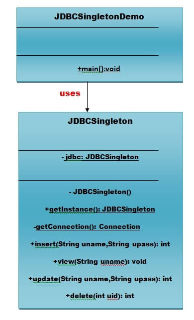

`Assumption`: you have created a table userdata that has three fields uid, uname and upassword in mysql database. Database name is ashwinirajput, username is root, password is ashwini.

*`File: JDBCSingleton.java`*
```java
import java.io.BufferedReader;
import java.io.IOException;
import java.io.InputStreamReader;
import java.sql.Connection;
import java.sql.DriverManager;
import java.sql.PreparedStatement;
import java.sql.ResultSet;
import java.sql.SQLException;

class JDBCSingleton {
    //Step 1  
    // create a JDBCSingleton class.  
    //static member holds only one instance of the JDBCSingleton class.  

    private static JDBCSingleton jdbc;

    //JDBCSingleton prevents the instantiation from any other class.  
    private JDBCSingleton() {
    }

    //Now we are providing gloabal point of access.  
    public static JDBCSingleton getInstance() {
        if (jdbc == null) {
            jdbc = new JDBCSingleton();
        }
        return jdbc;
    }

    // to get the connection from methods like insert, view etc.   
    private static Connection getConnection() throws ClassNotFoundException, SQLException {

        Connection con = null;
        Class.forName("com.mysql.jdbc.Driver");
        con = DriverManager.getConnection("jdbc:mysql://localhost:3306/ashwanirajput", "root", "ashwani");
        return con;

    }

    //to insert the record into the database   
    public int insert(String name, String pass) throws SQLException {
        Connection c = null;

        PreparedStatement ps = null;

        int recordCounter = 0;

        try {

            c = this.getConnection();
            ps = c.prepareStatement("insert into userdata(uname,upassword)values(?,?)");
            ps.setString(1, name);
            ps.setString(2, pass);
            recordCounter = ps.executeUpdate();

        } catch (Exception e) {
            e.printStackTrace();
        } finally {
            if (ps != null) {
                ps.close();
            }
            if (c != null) {
                c.close();
            }
        }
        return recordCounter;
    }

    //to view the data from the database        
    public void view(String name) throws SQLException {
        Connection con = null;
        PreparedStatement ps = null;
        ResultSet rs = null;

        try {

            con = this.getConnection();
            ps = con.prepareStatement("select * from userdata where uname=?");
            ps.setString(1, name);
            rs = ps.executeQuery();
            while (rs.next()) {
                System.out.println("Name= " + rs.getString(2) + "\t" + "Paasword= " + rs.getString(3));

            }

        } catch (Exception e) {
            System.out.println(e);
        } finally {
            if (rs != null) {
                rs.close();
            }
            if (ps != null) {
                ps.close();
            }
            if (con != null) {
                con.close();
            }
        }
    }

    // to update the password for the given username  
    public int update(String name, String password) throws SQLException {
        Connection c = null;
        PreparedStatement ps = null;

        int recordCounter = 0;
        try {
            c = this.getConnection();
            ps = c.prepareStatement(" update userdata set upassword=? where uname='" + name + "' ");
            ps.setString(1, password);
            recordCounter = ps.executeUpdate();
        } catch (Exception e) {
            e.printStackTrace();
        } finally {

            if (ps != null) {
                ps.close();
            }
            if (c != null) {
                c.close();
            }
        }
        return recordCounter;
    }

    // to delete the data from the database   
    public int delete(int userid) throws SQLException {
        Connection c = null;
        PreparedStatement ps = null;
        int recordCounter = 0;
        try {
            c = this.getConnection();
            ps = c.prepareStatement(" delete from userdata where uid='" + userid + "' ");
            recordCounter = ps.executeUpdate();
        } catch (Exception e) {
            e.printStackTrace();
        } finally {
            if (ps != null) {
                ps.close();
            }
            if (c != null) {
                c.close();
            }
        }
        return recordCounter;
    }
}// End of JDBCSingleton class  
```

*`File: JDBCSingletonDemo.java`*
```java
import java.io.BufferedReader;
import java.io.IOException;
import java.io.InputStreamReader;
import java.sql.Connection;
import java.sql.DriverManager;
import java.sql.PreparedStatement;
import java.sql.ResultSet;
import java.sql.SQLException;

class JDBCSingletonDemo {
    static int count = 1;
    static int choice;

    public static void main(String[] args) throws IOException {

        JDBCSingleton jdbc = JDBCSingleton.getInstance();


        BufferedReader br = new BufferedReader(new InputStreamReader(System.in));
        do {
            System.out.println("DATABASE OPERATIONS");
            System.out.println(" --------------------- ");
            System.out.println(" 1. Insertion ");
            System.out.println(" 2. View      ");
            System.out.println(" 3. Delete    ");
            System.out.println(" 4. Update    ");
            System.out.println(" 5. Exit      ");

            System.out.print("\n");
            System.out.print("Please enter the choice what you want to perform in the database: ");

            choice = Integer.parseInt(br.readLine());
            switch (choice) {

                case 1: {
                    System.out.print("Enter the username you want to insert data into the database: ");
                    String username = br.readLine();
                    System.out.print("Enter the password you want to insert data into the database: ");
                    String password = br.readLine();

                    try {
                        int i = jdbc.insert(username, password);
                        if (i > 0) {
                            System.out.println((count++) + " Data has been inserted successfully");
                        } else {
                            System.out.println("Data has not been inserted ");
                        }

                    } catch (Exception e) {
                        System.out.println(e);
                    }

                    System.out.println("Press Enter key to continue...");
                    System.in.read();

                }//End of case 1  
                break;
                case 2: {
                    System.out.print("Enter the username : ");
                    String username = br.readLine();

                    try {
                        jdbc.view(username);
                    } catch (Exception e) {
                        System.out.println(e);
                    }
                    System.out.println("Press Enter key to continue...");
                    System.in.read();

                }//End of case 2  
                break;
                case 3: {
                    System.out.print("Enter the userid,  you want to delete: ");
                    int userid = Integer.parseInt(br.readLine());

                    try {
                        int i = jdbc.delete(userid);
                        if (i > 0) {
                            System.out.println((count++) + " Data has been deleted successfully");
                        } else {
                            System.out.println("Data has not been deleted");
                        }

                    } catch (Exception e) {
                        System.out.println(e);
                    }
                    System.out.println("Press Enter key to continue...");
                    System.in.read();

                }//End of case 3  
                break;
                case 4: {
                    System.out.print("Enter the username,  you want to update: ");
                    String username = br.readLine();
                    System.out.print("Enter the new password ");
                    String password = br.readLine();

                    try {
                        int i = jdbc.update(username, password);
                        if (i > 0) {
                            System.out.println((count++) + " Data has been updated successfully");
                        }

                    } catch (Exception e) {
                        System.out.println(e);
                    }
                    System.out.println("Press Enter key to continue...");
                    System.in.read();

                }// end of case 4  
                break;

                default:
                    return;
            }

        } while (choice != 4);
    }
}  
```

- [download this Singleton Pattern Example](/src/singleton.zip)
- Ouput

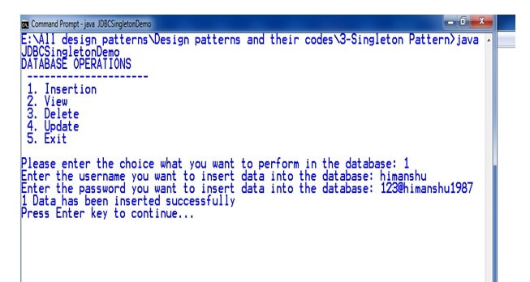

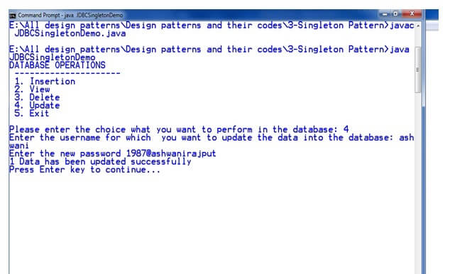


### 1.4 Prototype Pattern
Prototype Pattern says that cloning of an existing object instead of creating new one and can also be customized as per the requirement.

This pattern should be followed, if the cost of creating a new object is expensive and resource intensive.

#### Advantage of Prototype Pattern

The main advantages of prototype pattern are as follows:
- It reduces the need of sub-classing.
- It hides complexities of creating objects.
- The clients can get new objects without knowing which type of object it will be.
- It lets you add or remove objects at runtime.

#### Usage of Prototype Pattern
- When the classes are instantiated at runtime.
- When the cost of creating an object is expensive or complicated.
- When you want to keep the number of classes in an application minimum.
- When the client application needs to be unaware of object creation and representation.

#### UML for Prototype Pattern

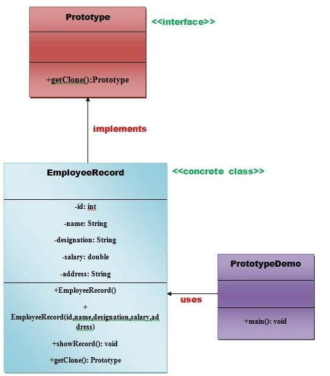

- We are going to create an interface *Prototype* that contains a method *getClone()* of *Prototype* type.
- Then, we create a concrete class *EmployeeRecord* which implements *Prototype* interface that does the cloning of *EmployeeRecord* object.
- *PrototypeDemo* class will uses this concrete class *EmployeeRecord*.

#### Example of Prototype Design Pattern

Let's see the example of prototype design pattern.

*File: Prototype.java*
```java
interface Prototype {  
  
     public Prototype getClone();  
      
}//End of Prototype interface.  
```
*File: EmployeeRecord.java*
```java
class EmployeeRecord implements Prototype {

    private int id;
    private String name, designation;
    private double salary;
    private String address;

    public EmployeeRecord() {
        System.out.println("   Employee Records of Oracle Corporation ");
        System.out.println("---------------------------------------------");
        System.out.println("Eid" + "\t" + "Ename" + "\t" + "Edesignation" + "\t" + "Esalary" + "\t\t" + "Eaddress");

    }

    public EmployeeRecord(int id, String name, String designation, double salary, String address) {

        this();
        this.id = id;
        this.name = name;
        this.designation = designation;
        this.salary = salary;
        this.address = address;
    }

    public void showRecord() {

        System.out.println(id + "\t" + name + "\t" + designation + "\t" + salary + "\t" + address);
    }

    @Override
    public Prototype getClone() {

        return new EmployeeRecord(id, name, designation, salary, address);
    }
}//End of EmployeeRecord class. 
```

*File: PrototypeDemo.java*
```java
import java.io.BufferedReader;
import java.io.IOException;
import java.io.InputStreamReader;

class PrototypeDemo {
    public static void main(String[] args) throws IOException {

        BufferedReader br = new BufferedReader(new InputStreamReader(System.in));
        System.out.print("Enter Employee Id: ");
        int eid = Integer.parseInt(br.readLine());
        System.out.print("\n");

        System.out.print("Enter Employee Name: ");
        String ename = br.readLine();
        System.out.print("\n");

        System.out.print("Enter Employee Designation: ");
        String edesignation = br.readLine();
        System.out.print("\n");

        System.out.print("Enter Employee Address: ");
        String eaddress = br.readLine();
        System.out.print("\n");

        System.out.print("Enter Employee Salary: ");
        double esalary = Double.parseDouble(br.readLine());
        System.out.print("\n");

        EmployeeRecord e1 = new EmployeeRecord(eid, ename, edesignation, esalary, eaddress);

        e1.showRecord();
        System.out.println("\n");
        EmployeeRecord e2 = (EmployeeRecord) e1.getClone();
        e2.showRecord();
    }
}//End of the ProtoypeDemo class.  
```
- [download this Prototype Pattern Example](src/PrototypePattern.zip)
- Output

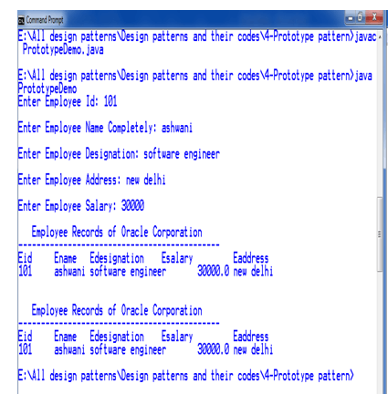

### 1.5 Builder Pattern
Builder Pattern says that **`construct a complex object from simple objects using step-by-step approach`**

It is mostly used when object can't be created in single step like in the de-serialization of a complex object.

#### Advantage of Builder Design Pattern

The main advantages of Builder Pattern are as follows:

- It provides clear separation between the construction and representation of an object.
- It provides better control over construction process.
- It supports to change the internal representation of objects.

#### UML for Builder Pattern Example

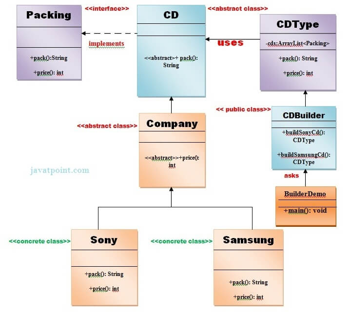

#### Example of Builder Design Pattern
To create simple example of builder design pattern, you need to follow 6 following steps.

- 1) [Create Packing interface](#create-packing-interface)
- 2) Create 2 abstract classes CD and Company
- 3) Create 2 implementation classes of Company: Sony and Samsung
- 4) Create the CDType class
- 5)  Create the CDBuilder class
- 6)  Create the BuilderDemo class

##### 1) Create Packing interface
*File: Packing.java*
```java
public interface Packing {
    public String pack();

    public int price();
} 
```
##### 2) Create 2 abstract classes CD and Company
Create an abstract class CD which will implement Packing interface.
*File: CD.java*
```java
public abstract class CD implements Packing {
    public abstract String pack();
}
```
*File: Company.java*
```java
public abstract class Company extends CD {
    public abstract int price();
} 
```
##### 3) Create 2 implementation classes of Company: Sony and Samsung
*File: Sony.java*
```java
public class Sony extends Company {
    @Override
    public int price() {
        return 20;
    }

    @Override
    public String pack() {
        return "Sony CD";
    }
}//End of the Sony class.  
```
*File: Samsung.java*
```java
public class Samsung extends Company {
    @Override
    public int price() {
        return 15;
    }

    @Override
    public String pack() {
        return "Samsung CD";
    }
}//End of the Samsung class.  
```
##### 4) Create the CDType class
*File: CDType.java*
```java
import java.util.ArrayList;
import java.util.List;

public class CDType {
    private List<Packing> items = new ArrayList<Packing>();

    public void addItem(Packing packs) {
        items.add(packs);
    }

    public void getCost() {
        for (Packing packs : items) {
            packs.price();
        }
    }

    public void showItems() {
        for (Packing packing : items) {
            System.out.print("CD name : " + packing.pack());
            System.out.println(", Price : " + packing.price());
        }
    }
}//End of the CDType class.  
```
##### 5) Create the CDBuilder class
*File: CDBuilder.java*
```java
public class CDBuilder {
    public CDType buildSonyCD() {
        CDType cds = new CDType();
        cds.addItem(new Sony());
        return cds;
    }

    public CDType buildSamsungCD() {
        CDType cds = new CDType();
        cds.addItem(new Samsung());
        return cds;
    }
}// End of the CDBuilder class.  
```
##### 6) Create the BuilderDemo class
*File: BuilderDemo.java*
```java
public class BuilderDemo {
    public static void main(String args[]) {
        CDBuilder cdBuilder = new CDBuilder();
        CDType cdType1 = cdBuilder.buildSonyCD();
        cdType1.showItems();

        CDType cdType2 = cdBuilder.buildSamsungCD();
        cdType2.showItems();
    }
}  
```
#### [download this builder pattern example](src/builder1.zip)

#### Output of the above example
```java
CD name : Sony CD, Price : 20  
CD name : Samsung CD, Price : 15
```

#### Another Real world example of Builder Pattern
##### UML for Builder Pattern:
We are considering a business case of `pizza-hut` where we can get different varieties of pizza and cold-drink.

`Pizza` can be either a Veg pizza or Non-Veg pizza of several types (like cheese pizza, onion pizza, masala-pizza etc) and will be of 4 sizes i.e. small, medium, large, extra-large.

`Cold-drink` can be of several types (like Pepsi, Coke, Dew, Sprite, Fanta, Maaza, Limca, Thums-up etc.) and will be of 3 sizes small, medium, large.
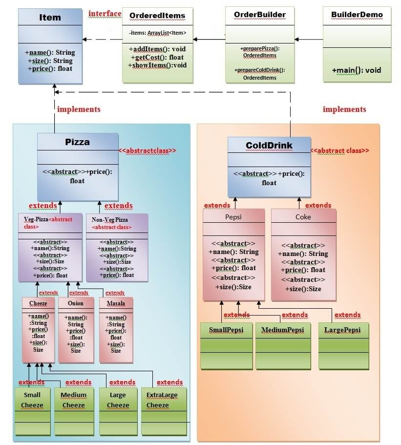

##### Real world example of builder pattern
Let's see the step by step real world example of Builder Design Pattern.
- Step 1:**Create an interface Item that represents the Pizza and Cold-drink**.
*File: Item.java*
```java
public interface Item {
    public String name();

    public String size();

    public float price();
}// End of the interface Item.  
```
- Step 2:**Create an abstract class Pizza that will implement to the interface Item**.
*File: Pizza.java*
```java
public abstract class Pizza implements Item {
    @Override
    public abstract float price();
}
```
- Step 3:**Create an abstract class ColdDrink that will implement to the interface Item**.
*File: ColdDrink.java*
```java
public abstract class ColdDrink implements Item {
    @Override
    public abstract float price();
}
```
- Step 4:**Create an abstract class VegPizza that will extend to the abstract class Pizza**.
*File: VegPizza.java*
```java
public abstract class VegPizza extends Pizza {
    @Override
    public abstract float price();

    @Override
    public abstract String name();

    @Override
    public abstract String size();
}// End of the abstract class VegPizza.  
```
- Step 5:**Create an abstract class NonVegPizza that will extend to the abstract class Pizza**.
*File: NonVegPizza.java*
```java
public abstract class NonVegPizza extends Pizza {
    @Override
    public abstract float price();

    @Override
    public abstract String name();

    @Override
    public abstract String size();
}// End of the abstract class NonVegPizza. 
```
- Step 6:**Now, create concrete sub-classes SmallCheezePizza, MediumCheezePizza, LargeCheezePizza, ExtraLargeCheezePizza that will extend to the abstract class VegPizza**.
*File: SmallCheezePizza.java*
```java
public class SmallCheezePizza extends VegPizza {
    @Override
    public float price() {
        return 170.0f;
    }

    @Override
    public String name() {
        return "Cheeze Pizza";
    }

    @Override
    public String size() {
        return "Small size";
    }
}// End of the SmallCheezePizza class.  
```
*File: MediumCheezePizza.java*
```java
public class MediumCheezePizza extends VegPizza {
    @Override
    public float price() {
        return 220.f;
    }

    @Override
    public String name() {
        return "Cheeze Pizza";
    }

    @Override
    public String size() {
        return "Medium Size";
    }
}// End of the MediumCheezePizza class.  
```

*File: LargeCheezePizza.java*
```java
public class LargeCheezePizza extends VegPizza {
    @Override
    public float price() {
        return 260.0f;
    }

    @Override
    public String name() {
        return "Cheeze Pizza";
    }

    @Override
    public String size() {
        return "Large Size";
    }
}// End of the LargeCheezePizza class.  
```

*File: ExtraLargeCheezePizza.java*
```java
public class ExtraLargeCheezePizza extends VegPizza {
    @Override
    public float price() {
        return 300.f;
    }

    @Override
    public String name() {
        return "Cheeze Pizza";
    }

    @Override
    public String size() {
        return "Extra-Large Size";
    }
}// End of the ExtraLargeCheezePizza class.  
```

- Step 7:**Now, similarly create concrete sub-classes SmallOnionPizza, MediumOnionPizza, LargeOnionPizza, ExtraLargeOnionPizza that will extend to the abstract class VegPizza**.

*File: SmallOnionPizza.java*

```java
public class SmallOnionPizza extends VegPizza {
    @Override
    public float price() {
        return 120.0f;
    }

    @Override
    public String name() {
        return "Onion Pizza";
    }

    @Override
    public String size() {
        return "Small Size";
    }
}// End of the SmallOnionPizza class.  
```

*File: MediumOnionPizza.java*
```java
public class MediumOnionPizza extends VegPizza {
    @Override
    public float price() {
        return 150.0f;
    }

    @Override
    public String name() {
        return "Onion Pizza";
    }

    @Override
    public String size() {
        return "Medium Size";
    }
}// End of the MediumOnionPizza class.  
```
*File: LargeOnionPizza.java*
```java
public class LargeOnionPizza extends VegPizza {
    @Override
    public float price() {
        return 180.0f;
    }

    @Override
    public String name() {
        return "Onion Pizza";
    }

    @Override
    public String size() {
        return "Large size";
    }
}// End of the LargeOnionPizza class.  
```

*File: ExtraLargeOnionPizza.java*
```java
public class ExtraLargeOnionPizza extends VegPizza {
    @Override
    public float price() {
        return 200.0f;
    }

    @Override
    public String name() {
        return "Onion Pizza";
    }

    @Override
    public String size() {
        return "Extra-Large Size";
    }
}// End of the ExtraLargeOnionPizza class  
```

- Step 8:**Now, similarly create concrete sub-classes SmallMasalaPizza, MediumMasalaPizza, LargeMasalaPizza, ExtraLargeMasalaPizza that will extend to the abstract class VegPizza.**

*File: SmallMasalaPizza.java*
```java
public class SmallMasalaPizza extends VegPizza {
    @Override
    public float price() {
        return 100.0f;
    }

    @Override
    public String name() {
        return "Masala Pizza";
    }

    @Override
    public String size() {
        return "Samll Size";
    }
}// End of the SmallMasalaPizza class  
```
*File: MediumMasalaPizza.java*
```java
public class MediumMasalaPizza extends VegPizza {

    @Override
    public float price() {
        return 120.0f;
    }

    @Override
    public String name() {

        return "Masala Pizza";

    }

    @Override
    public String size() {
        return "Medium Size";
    }
}
```
*File: LargeMasalaPizza.java*
```java
public class LargeMasalaPizza extends VegPizza {
    @Override
    public float price() {
        return 150.0f;
    }

    @Override
    public String name() {

        return "Masala Pizza";

    }

    @Override
    public String size() {
        return "Large Size";
    }
} //End of the LargeMasalaPizza class  
```

*File: ExtraLargeMasalaPizza.java*
```java
public class ExtraLargeMasalaPizza extends VegPizza {
    @Override
    public float price() {
        return 180.0f;
    }

    @Override
    public String name() {

        return "Masala Pizza";

    }

    @Override
    public String size() {
        return "Extra-Large Size";
    }
}// End of the ExtraLargeMasalaPizza class  
```

- Step 9:**Now, create concrete sub-classes SmallNonVegPizza, MediumNonVegPizza, LargeNonVegPizza, ExtraLargeNonVegPizza that will extend to the abstract class NonVegPizza**.

*File: SmallNonVegPizza.java*
```java
public class SmallNonVegPizza extends NonVegPizza {

    @Override
    public float price() {
        return 180.0f;
    }

    @Override
    public String name() {
        return "Non-Veg Pizza";
    }

    @Override
    public String size() {
        return "Samll Size";
    }

}// End of the SmallNonVegPizza class 
```

*File: MediumNonVegPizza.java*
```java
public class MediumNonVegPizza extends NonVegPizza {

    @Override
    public float price() {
        return 200.0f;
    }

    @Override
    public String name() {
        return "Non-Veg Pizza";
    }

    @Override
    public String size() {
        return "Medium Size";
    }
}
```
*File: LargeNonVegPizza.java*
```java
public class LargeNonVegPizza extends NonVegPizza {

    @Override
    public float price() {
        return 220.0f;
    }

    @Override
    public String name() {
        return "Non-Veg Pizza";
    }

    @Override
    public String size() {
        return "Large Size";
    }

}// End of the LargeNonVegPizza class  
```

*File: ExtraLargeNonVegPizza.java*
```java
public class ExtraLargeNonVegPizza extends NonVegPizza {
    @Override
    public float price() {
        return 250.0f;
    }

    @Override
    public String name() {
        return "Non-Veg Pizza";
    }

    @Override
    public String size() {
        return "Extra-Large Size";
    }

}// End of the ExtraLargeNonVegPizza class  
```
- Step 10:**Now, create two abstract classes Pepsi and Coke that will extend abstract class ColdDrink**.

*File: Pepsi.java*
```java
public abstract class Pepsi extends ColdDrink {

    @Override
    public abstract String name();

    @Override
    public abstract String size();

    @Override
    public abstract float price();

}// End of the Pepsi class 
```

*File: Coke.java*
```java
public abstract class Coke extends ColdDrink {

    @Override
    public abstract String name();

    @Override
    public abstract String size();

    @Override
    public abstract float price();

}// End of the Coke class
```

- Step 11: **Now, create concrete sub-classes SmallPepsi, MediumPepsi, LargePepsi that will extend to the abstract class Pepsi.**

*File: SmallPepsi.java*
```java
public class SmallPepsi extends Pepsi {

    @Override
    public String name() {
        return "300 ml Pepsi";
    }

    @Override
    public float price() {
        return 25.0f;
    }

    @Override
    public String size() {
        return "Small Size";
    }
}// End of the SmallPepsi class
```

*File: MediumPepsi.java*
```java
public class MediumPepsi extends Pepsi {

    @Override
    public String name() {
        return "500 ml Pepsi";
    }

    @Override
    public String size() {
        return "Medium Size";
    }

    @Override
    public float price() {
        return 35.0f;
    }
}// End of the MediumPepsi class
```

*File: LargePepsi.java*
```java
public class LargePepsi extends Pepsi {
    @Override
    public String name() {
        return "750 ml Pepsi";
    }

    @Override
    public String size() {
        return "Large Size";
    }

    @Override
    public float price() {
        return 50.0f;
    }
}// End of the LargePepsi class 
```

- Step 12:**Now, create concrete sub-classes SmallCoke, MediumCoke, LargeCoke that will extend to the abstract class Coke**.

*File: SmallCoke.java*
```java
public class SmallCoke extends Coke {

    @Override
    public String name() {
        return "300 ml Coke";
    }

    @Override
    public String size() {

        return "Small Size";
    }

    @Override
    public float price() {

        return 25.0f;
    }
}// End of the SmallCoke class 
```

*File: MediumCoke.java*
```java
public class MediumCoke extends Coke {

    @Override
    public String name() {
        return "500 ml Coke";
    }

    @Override
    public String size() {

        return "Medium Size";
    }

    @Override
    public float price() {

        return 35.0f;
    }
}// End of the MediumCoke class
```

*File: LargeCoke.java*
```java
public class LargeCoke extends Coke {
    @Override
    public String name() {
        return "750 ml Coke";
    }

    @Override
    public String size() {

        return "Large Size";
    }

    @Override
    public float price() {

        return 50.0f;
    }
}// End of the LargeCoke class
```

- Step 13: **Create an OrderedItems class that are having Item objects defined above.**

*File: OrderedItems.java*
```java
import java.util.ArrayList;
import java.util.List;

public class OrderedItems {

    List<Item> items = new ArrayList<Item>();

    public void addItems(Item item) {

        items.add(item);
    }

    public float getCost() {

        float cost = 0.0f;
        for (Item item : items) {
            cost += item.price();
        }
        return cost;
    }

    public void showItems() {

        for (Item item : items) {
            System.out.println("Item is:" + item.name());
            System.out.println("Size is:" + item.size());
            System.out.println("Price is: " + item.price());

        }
    }

}// End of the OrderedItems class 
```

- Step 14:**Create an OrderBuilder class that will be responsible to create the objects of OrderedItems class**.

*File: OrdereBuilder.java*
```java
import java.io.BufferedReader;
import java.io.IOException;
import java.io.InputStreamReader;

public class OrderBuilder {
    public OrderedItems preparePizza() throws IOException {

        OrderedItems itemsOrder = new OrderedItems();
        BufferedReader br = new BufferedReader(new InputStreamReader(System.in));

        System.out.println(" Enter the choice of Pizza ");
        System.out.println("============================");
        System.out.println("        1. Veg-Pizza       ");
        System.out.println("        2. Non-Veg Pizza   ");
        System.out.println("        3. Exit            ");
        System.out.println("============================");

        int pizzaandcolddrinkchoice = Integer.parseInt(br.readLine());
        switch (pizzaandcolddrinkchoice) {
            case 1: {

                System.out.println("You ordered Veg Pizza");
                System.out.println("\n\n");
                System.out.println(" Enter the types of Veg-Pizza ");
                System.out.println("------------------------------");
                System.out.println("        1.Cheeze Pizza        ");
                System.out.println("        2.Onion Pizza        ");
                System.out.println("        3.Masala Pizza        ");
                System.out.println("        4.Exit            ");
                System.out.println("------------------------------");
                int vegpizzachoice = Integer.parseInt(br.readLine());
                switch (vegpizzachoice) {
                    case 1: {
                        System.out.println("You ordered Cheeze Pizza");

                        System.out.println("Enter the cheeze pizza size");
                        System.out.println("------------------------------------");
                        System.out.println("    1. Small Cheeze Pizza ");
                        System.out.println("    2. Medium Cheeze Pizza ");
                        System.out.println("    3. Large Cheeze Pizza ");
                        System.out.println("    4. Extra-Large Cheeze Pizza ");
                        System.out.println("------------------------------------");
                        int cheezepizzasize = Integer.parseInt(br.readLine());
                        switch (cheezepizzasize) {
                            case 1:
                                itemsOrder.addItems(new SmallCheezePizza());
                                break;
                            case 2:
                                itemsOrder.addItems(new MediumCheezePizza());
                                break;
                            case 3:
                                itemsOrder.addItems(new LargeCheezePizza());
                                break;
                            case 4:
                                itemsOrder.addItems(new ExtraLargeCheezePizza());
                                break;
                            case 2: {
                                System.out.println("You ordered Onion Pizza");
                                System.out.println("Enter the Onion pizza size");
                                System.out.println("----------------------------------");
                                System.out.println("    1. Small Onion Pizza ");
                                System.out.println("    2. Medium Onion Pizza ");
                                System.out.println("    3. Large Onion Pizza ");
                                System.out.println("    4. Extra-Large Onion Pizza ");
                                System.out.println("----------------------------------");
                                int onionpizzasize = Integer.parseInt(br.readLine());
                                switch (onionpizzasize) {
                                    case 1:
                                        itemsOrder.addItems(new SmallOnionPizza());
                                        break;

                                    case 2:
                                        itemsOrder.addItems(new MediumOnionPizza());
                                        break;

                                    case 3:
                                        itemsOrder.addItems(new LargeOnionPizza());
                                        break;

                                    case 4:
                                        itemsOrder.addItems(new ExtraLargeOnionPizza());
                                        break;

                                }
                            }
                            break;
                            case 3: {
                                System.out.println("You ordered Masala Pizza");
                                System.out.println("Enter the Masala pizza size");
                                System.out.println("------------------------------------");
                                System.out.println("    1. Small Masala Pizza ");
                                System.out.println("    2. Medium Masala Pizza ");
                                System.out.println("    3. Large Masala Pizza ");
                                System.out.println("    4. Extra-Large Masala Pizza ");
                                System.out.println("------------------------------------");
                                int masalapizzasize = Integer.parseInt(br.readLine());
                                switch (masalapizzasize) {
                                    case 1:
                                        itemsOrder.addItems(new SmallMasalaPizza());
                                        break;

                                    case 2:
                                        itemsOrder.addItems(new MediumMasalaPizza());
                                        break;

                                    case 3:
                                        itemsOrder.addItems(new LargeMasalaPizza());
                                        break;

                                    case 4:
                                        itemsOrder.addItems(new ExtraLargeMasalaPizza());
                                        break;

                                }

                            }
                            break;

                        }

                    }
                    break;// Veg- pizza choice completed.  

                    case 2: {
                        System.out.println("You ordered Non-Veg Pizza");
                        System.out.println("\n\n");

                        System.out.println("Enter the Non-Veg pizza size");
                        System.out.println("------------------------------------");
                        System.out.println("    1. Small Non-Veg  Pizza ");
                        System.out.println("    2. Medium Non-Veg  Pizza ");
                        System.out.println("    3. Large Non-Veg  Pizza ");
                        System.out.println("    4. Extra-Large Non-Veg  Pizza ");
                        System.out.println("------------------------------------");


                        int nonvegpizzasize = Integer.parseInt(br.readLine());

                        switch (nonvegpizzasize) {

                            case 1:
                                itemsOrder.addItems(new SmallNonVegPizza());
                                break;

                            case 2:
                                itemsOrder.addItems(new MediumNonVegPizza());
                                break;

                            case 3:
                                itemsOrder.addItems(new LargeNonVegPizza());
                                break;

                            case 4:
                                itemsOrder.addItems(new ExtraLargeNonVegPizza());
                                break;
                        }

                    }
                    break;
                    default: {
                        break;

                    }

                }//end of main Switch  

                //continued?..  
                System.out.println(" Enter the choice of ColdDrink ");
                System.out.println("============================");
                System.out.println("        1. Pepsi            ");
                System.out.println("        2. Coke             ");
                System.out.println("        3. Exit             ");
                System.out.println("============================");
                int coldDrink = Integer.parseInt(br.readLine());
                switch (coldDrink) {
                    case 1: {
                        System.out.println("You ordered Pepsi ");
                        System.out.println("Enter the  Pepsi Size ");
                        System.out.println("------------------------");
                        System.out.println("    1. Small Pepsi ");
                        System.out.println("    2. Medium Pepsi ");
                        System.out.println("    3. Large Pepsi ");
                        System.out.println("------------------------");
                        int pepsisize = Integer.parseInt(br.readLine());
                        switch (pepsisize) {
                            case 1:
                                itemsOrder.addItems(new SmallPepsi());
                                break;

                            case 2:
                                itemsOrder.addItems(new MediumPepsi());
                                break;

                            case 3:
                                itemsOrder.addItems(new LargePepsi());
                                break;

                        }
                    }
                    break;
                    case 2: {
                        System.out.println("You ordered Coke");
                        System.out.println("Enter the Coke Size");
                        System.out.println("------------------------");
                        System.out.println("    1. Small Coke ");
                        System.out.println("    2. Medium Coke  ");
                        System.out.println("    3. Large Coke  ");
                        System.out.println("    4. Extra-Large Coke ");
                        System.out.println("------------------------");

                        int cokesize = Integer.parseInt(br.readLine());
                        switch (cokesize) {
                            case 1:
                                itemsOrder.addItems(new SmallCoke());
                                break;

                            case 2:
                                itemsOrder.addItems(new MediumCoke());
                                break;

                            case 3:
                                itemsOrder.addItems(new LargeCoke());
                                break;


                        }

                    }
                    break;
                    default: {
                        break;

                    }

                }//End of the Cold-Drink switch  
                return itemsOrder;

            } //End of the preparePizza() method 
        }
    }
}
```

- Step 15: **Create a BuilderDemo class that will use the OrderBuilder class**.

*File: BuilderDemo.java*
```java
import java.io.IOException;

public class BuilderDemo {

    public static void main(String[] args) throws IOException {
        // TODO code application logic here  

        OrderBuilder builder = new OrderBuilder();

        OrderedItems orderedItems = builder.preparePizza();

        orderedItems.showItems();

        System.out.println("\n");
        System.out.println("Total Cost : " + orderedItems.getCost());

    }
}// End of the BuilderDemo class
```

#### [download this Builder Pattern Example](src/5-Builderpattern.zip)

#### Output

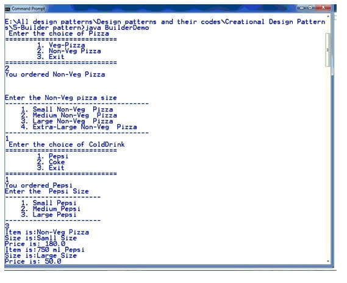

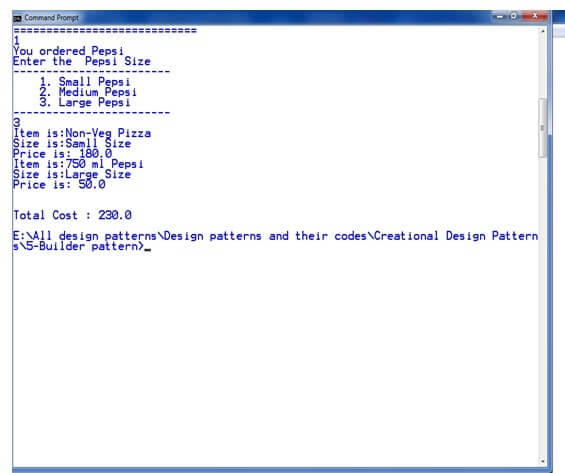

### 1.6 Object Pool Pattern

Mostly, performance is the key issue during the software development and the object creation, which may be a costly step.

Object Pool Pattern says that **`to reuse the object that are expensive to create`**.

Basically, an Object pool is a container which contains a specified amount of objects. When an object is taken from the pool, it is not available in the pool until it is put back. **`Objects in the pool have a lifecycle: creation, validation and destroy`**.

A pool helps to manage available resources in a better way. There are many using examples: especially in application servers there are data source pools, thread pools etc.

#### Advantage of Object Pool design pattern
- It boosts the performance of the application significantly.
- It is most effective in a situation where the rate of initializing a class instance is high.
- It manages the connections and provides a way to reuse and share them.
- It can also provide the limit for the maximum number of objects that can be created.

#### Usage:
- When an application requires objects which are expensive to create. Eg: there is a need of opening too many connections for the database then it takes too longer to create a new one and the database server will be overloaded.
- When there are several clients who need the same resource at different times.

:book: **`NOTE: Object pool design pattern is essentially used in Web Container of the server for creating thread pools and data source pools to process the requests`**.

#### Example of Object Pool Pattern:

Let's understand the example by the given UML diagram.

##### UML for Object Pool Pattern

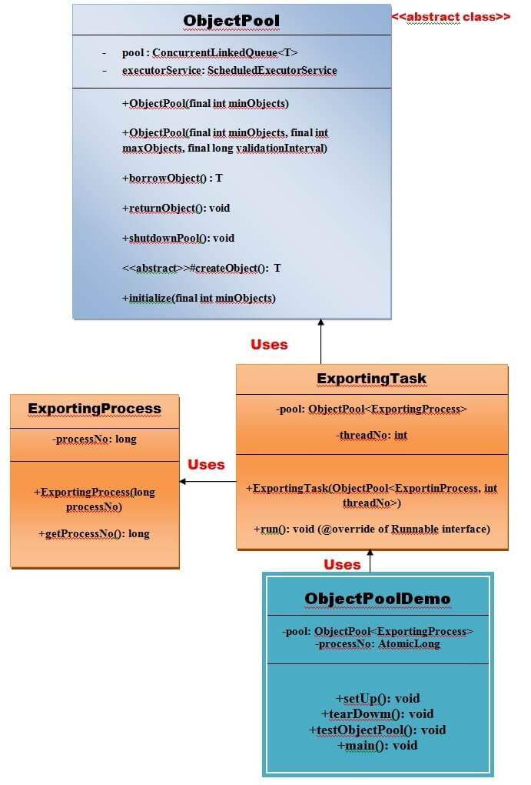

##### Implementation of above UML:

- Step 1 **Create an ObjectPool class that is used to create the number of objects**.

*File: ObjectPool.java*
```java
import java.util.concurrent.ConcurrentLinkedQueue;
import java.util.concurrent.Executors;
import java.util.concurrent.ScheduledExecutorService;
import java.util.concurrent.TimeUnit;

public abstract class ObjectPool<T> {  
/* 
  pool implementation is based on ConcurrentLinkedQueue from the java.util.concurrent package. 
  ConcurrentLinkedQueue is a thread-safe queue based on linked nodes.  
   Because the queue follows FIFO technique (first-in-first-out). 
 */

    private ConcurrentLinkedQueue<T> pool;

    /*  
      
      ScheduledExecutorService starts a special task in a separate thread and observes 
      the minimum and maximum number of objects in the pool periodically in a specified  
       time (with parameter validationInterval).  
      When the number of objects is less than the minimum, missing instances will be created.  
      When the number of objects is greater than the maximum, too many instances will be removed.  
      This is sometimes useful for the balance of memory consuming objects in the pool. 
   */
    private ScheduledExecutorService executorService;
    /*
     * Creates the pool.
     *
     * @param minObjects : the minimum number of objects residing in the pool
     */

    public ObjectPool(final int minObjects) {
        // initialize pool  

        initialize(minObjects);

    }

    /* 
      Creates the pool. 
      @param minObjects:   minimum number of objects residing in the pool. 
      @param maxObjects:   maximum number of objects residing in the pool. 
      @param validationInterval: time in seconds for periodical checking of  
         minObjects / maxObjects conditions in a separate thread. 
      When the number of objects is less than minObjects, missing instances will be created. 
      When the number of objects is greater than maxObjects, too many instances will be removed. 
    */
    public ObjectPool(final int minObjects, final int maxObjects, final long validationInterval) {
        // initialize pool  
        initialize(minObjects);
        // check pool conditions in a separate thread  
        executorService = Executors.newSingleThreadScheduledExecutor();
        executorService.scheduleWithFixedDelay(new Runnable()  // annonymous class  
        {
            @Override
            public void run() {
                int size = pool.size();

                if (size < minObjects) {
                    int sizeToBeAdded = minObjects + size;
                    for (int i = 0; i < sizeToBeAdded; i++) {
                        pool.add(createObject());
                    }
                } else if (size > maxObjects) {
                    int sizeToBeRemoved = size - maxObjects;
                    for (int i = 0; i < sizeToBeRemoved; i++) {
                        pool.poll();
                    }
                }
            }
        }, validationInterval, validationInterval, TimeUnit.SECONDS);
    }

    /* 
        Gets the next free object from the pool. If the pool doesn't contain any objects, 
        a new object will be created and given to the caller of this method back. 
        
        @return T borrowed object 
    */
    public T borrowObject() {
        T object;
        if ((object = pool.poll()) == null) {
            object = createObject();
        }
        return object;
    }

    /* 
         Returns object back to the pool. 
         @param object object to be returned 
     */
    public void returnObject(T object) {
        if (object == null) {
            return;
        }
        this.pool.offer(object);
    }

    /* 
         Shutdown this pool. 
     */
    public void shutdown() {
        if (executorService != null) {
            executorService.shutdown();
        }
    }

    /* 
        Creates a new object. 
         @return T new object 
     */
    protected abstract T createObject();

    private void initialize(final int minObjects) {
        pool = new ConcurrentLinkedQueue<T>();
        for (int i = 0; i < minObjects; i++) {
            pool.add(createObject());
        }
    }
}// End of the ObjectPool Class.  
```

- Step 2 **Create an ExportingProcess class that will be used by ExportingTask class**.

*File: ExportingProcess.java*
```java
public class ExportingProcess {
    private long processNo;

    public ExportingProcess(long processNo) {
        this.processNo = processNo;
        // do some  expensive calls / tasks here in future  
        // .........  
        System.out.println("Object with process no. " + processNo + " was created");
    }

    public long getProcessNo() {
        return processNo;
    }
}// End of the ExportingProcess class.  
```

- Step 3 **Create an ExportingTask class that will use ExportingProcess and ObjectPool class.**

*File: ExportingTask.java*
```java
public class ExportingTask implements Runnable {
    private ObjectPool<ExportingProcess> pool;
    private int threadNo;

    public ExportingTask(ObjectPool<ExportingProcess> pool, int threadNo) {
        this.pool = pool;
        this.threadNo = threadNo;
    }

    public void run() {
        // get an object from the pool
        ExportingProcess exportingProcess = pool.borrowObject();
        System.out.println("Thread " + threadNo + ": Object with process no. "
                + exportingProcess.getProcessNo() + " was borrowed");

        //you can  do something here in future
        // .........

        // return ExportingProcess instance back to the pool
        pool.returnObject(exportingProcess);

        System.out.println("Thread " + threadNo + ": Object with process no. "
                + exportingProcess.getProcessNo() + " was returned");
    }

}// End of the ExportingTask class. 
```

- Step 4 **Create an ObjectPoolDemo class.**

*File: ObjectPoolDemo.java*

```java
import java.util.concurrent.ExecutorService;
import java.util.concurrent.Executors;
import java.util.concurrent.TimeUnit;
import java.util.concurrent.atomic.AtomicLong;

public class ObjectPoolDemo {
    private ObjectPool<ExportingProcess> pool;
    private AtomicLong processNo = new AtomicLong(0);

    public void setUp() {
        // Create a pool of objects of type ExportingProcess.  
           /*Parameters: 
             1) Minimum number of special ExportingProcess instances residing in the pool = 4 
             2) Maximum number of special ExportingProcess instances residing in the pool = 10 
             3) Time in seconds for periodical checking of minObjects / maxObjects conditions 
                in a separate thread = 5. 
             -->When the number of ExportingProcess instances is less than minObjects,  
                 missing instances will be created. 
             -->When the number of ExportingProcess instances is greater than maxObjects, 
                  too many instances will be removed. 
            -->If the validation interval is negative, no periodical checking of  
                  minObjects / maxObjects conditions in a separate thread take place. 
              These boundaries are ignored then. 
           */
        pool = new ObjectPool<ExportingProcess>(4, 10, 5) {
            protected ExportingProcess createObject() {
                // create a test object which takes some time for creation  
                return new ExportingProcess(processNo.incrementAndGet());
            }
        };
    }

    public void tearDown() {
        pool.shutdown();
    }

    public void testObjectPool() {
        ExecutorService executor = Executors.newFixedThreadPool(8);

        // execute 8 tasks in separate threads  

        executor.execute(new ExportingTask(pool, 1));
        executor.execute(new ExportingTask(pool, 2));
        executor.execute(new ExportingTask(pool, 3));
        executor.execute(new ExportingTask(pool, 4));
        executor.execute(new ExportingTask(pool, 5));
        executor.execute(new ExportingTask(pool, 6));
        executor.execute(new ExportingTask(pool, 7));
        executor.execute(new ExportingTask(pool, 8));

        executor.shutdown();
        try {
            executor.awaitTermination(30, TimeUnit.SECONDS);
        } catch (InterruptedException e) {
            e.printStackTrace();
        }
    }

    public static void main(String args[]) {
        ObjectPoolDemo op = new ObjectPoolDemo();
        op.setUp();
        op.tearDown();
        op.testObjectPool();
    }
}//End of the ObjectPoolDemo class.  
```

#### [download this Object Pool Pattern Example](src/objectpoolpattern.zip)

#### Output

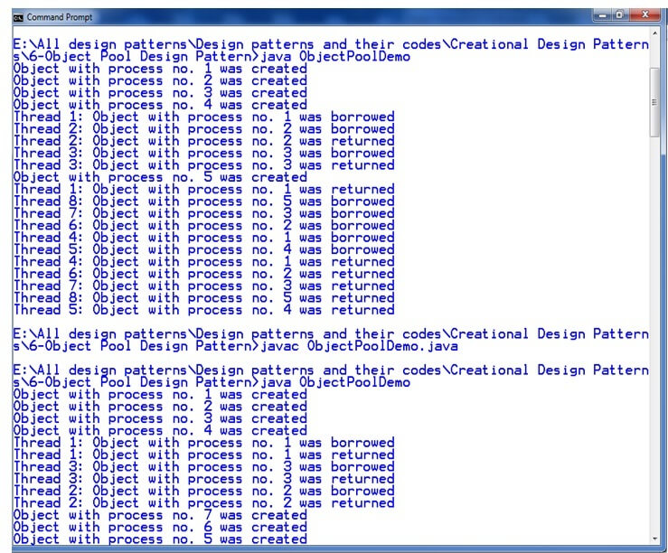

## 2. Structural Design Pattern

**Structural design** patterns are concerned with how classes and objects can be composed, to form larger structures.

The structural design patterns **simplifies the structure by identifying the relationships**.

These patterns focus on, how the classes inherit from each other and how they are composed from other classes.

### Types of structural design patterns

There are following 7 types of structural design patterns.

- [Adapter Pattern](#21-adapter-pattern-1)
    - Adapting an interface into another according to client expectation.

- [Bridge Pattern](#22-bridge-pattern-1)
    - Separating abstraction (interface) from implementation.

- [Composite Pattern](#23-composite-pattern-1)
    - Allowing clients to operate on hierarchy of objects.

- [Decorator Pattern](#24-decorator-pattern-1)
    - Adding functionality to an object dynamically.

- [Facade Pattern](#25-facade-pattern-1)
    - Providing an interface to a set of interfaces.

- [Flyweight Pattern](#26-flyweight-pattern-1)
    - Reusing an object by sharing it.

- [Proxy Pattern](#27-proxy-pattern-1)
    - Representing another object.


### 2.1 Adapter Pattern

An Adapter Pattern says that just **`converts the interface of a class into another interface that a client wants`**.

In other words, to provide the interface according to client requirement while using the services of a class with a different interface.

The Adapter Pattern is also known as **`Wrapper`**.

#### Advantage of Adapter Pattern
- It allows two or more previously incompatible objects to interact.
- It allows reusability of existing functionality.


#### Usage of Adapter pattern
It is used:
- When an object needs to utilize an existing class with an incompatible interface.
- When you want to create a reusable class that cooperates with classes which don't have compatible interfaces.
- When you want to create a reusable class that cooperates with classes which don't have compatible interfaces.

#### Example of Adapter Pattern

Let's understand the example of adapter design pattern by the above UML diagram.

#### UML for Adapter Pattern
There are the following specifications for the adapter pattern:

- **Target Interface**: This is the desired interface class which will be used by the clients.
- **Adapter class**: This class is a wrapper class which implements the desired target interface and modifies the specific request available from the Adaptee class.
- **Adaptee class**: This is the class which is used by the Adapter class to reuse the existing functionality and modify them for desired use.
- **Client**: This class will interact with the Adapter class.

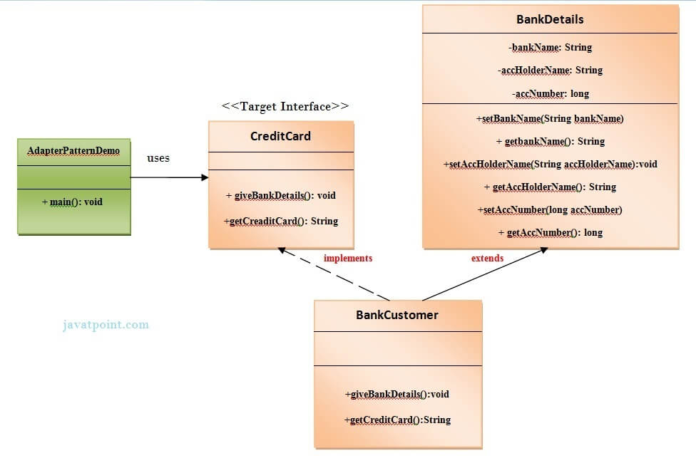

#### Implementation of above UML:

- Step 1 **Create a CreditCard interface (Target interface)**.

*File: CreditCard.java*
```java
public interface CreditCard {
    public void giveBankDetails();

    public String getCreditCard();
}// End of the CreditCard interface.  
```

- Step 2 **Create a BankDetails class (Adaptee class)**.
*File: BankDetails.java*
```java
// This is the adapter class.  
public class BankDetails {
    private String bankName;
    private String accHolderName;
    private long accNumber;

    public String getBankName() {
        return bankName;
    }

    public void setBankName(String bankName) {
        this.bankName = bankName;
    }

    public String getAccHolderName() {
        return accHolderName;
    }

    public void setAccHolderName(String accHolderName) {
        this.accHolderName = accHolderName;
    }

    public long getAccNumber() {
        return accNumber;
    }

    public void setAccNumber(long accNumber) {
        this.accNumber = accNumber;
    }
}// End of the BankDetails class. 
```

- Step 3 **Create a BankCustomer class (Adapter class)**.
*File: BankCustomer.java*
```java
// This is the adapter class  

import java.io.BufferedReader;
import java.io.InputStreamReader;

public class BankCustomer extends BankDetails implements CreditCard {
    public void giveBankDetails() {
        try {
            BufferedReader br = new BufferedReader(new InputStreamReader(System.in));

            System.out.print("Enter the account holder name :");
            String customername = br.readLine();
            System.out.print("\n");

            System.out.print("Enter the account number:");
            long accno = Long.parseLong(br.readLine());
            System.out.print("\n");

            System.out.print("Enter the bank name :");
            String bankname = br.readLine();

            setAccHolderName(customername);
            setAccNumber(accno);
            setBankName(bankname);
        } catch (Exception e) {
            e.printStackTrace();
        }
    }

    @Override
    public String getCreditCard() {
        long accno = getAccNumber();
        String accholdername = getAccHolderName();
        String bname = getBankName();

        return ("The Account number " + accno + " of " + accholdername + " in " + bname + "  
        bank is valid and authenticated for issuing the credit card.");  
    }
}//End of the BankCustomer class.  
```
- Step 4 **Create a AdapterPatternDemo class (client class)**.

*File: AdapterPatternDemo.java*
```java
//This is the client class.  
public class AdapterPatternDemo {
    public static void main(String args[]) {
        CreditCard targetInterface = new BankCustomer();
        targetInterface.giveBankDetails();
        System.out.print(targetInterface.getCreditCard());
    }
}//End of the BankCustomer class.  
```

#### [download this example](src/adapterpattern.zip)

#### Output

```java 
Enter the account holder name :Sonoo Jaiswal  
  
Enter the account number:10001  
  
Enter the bank name :State Bank of India  
  
The Account number 10001 of Sonoo Jaiswal in State Bank of India bank is valid   
and authenticated for issuing the credit card. 
```

### 2.2 Bridge Pattern

A Bridge Pattern says that just **decouple the functional abstraction from the implementation so that the two can vary independently**.

The Bridge Pattern is also known as **Handle or Body**.

#### Advantage of Bridge Pattern

- It enables the separation of implementation from the interface.
- It improves the extensibility.
- It allows the hiding of implementation details from the client.

#### Usage of Bridge Pattern

- When you don't want a permanent binding between the functional abstraction and its implementation.
- When both the functional abstraction and its implementation need to extended using sub-classes.
- It is mostly used in those places where changes are made in the implementation does not affect the clients.

#### Example of Bridge Pattern

The UML given below describes the example of bridge pattern.

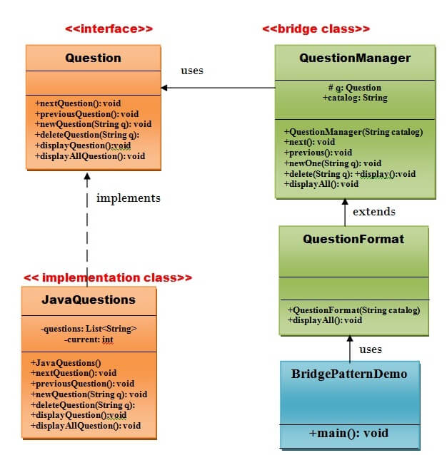

#### Implementation of above UML

- Step 1 Create a **Question** interface that provides the navigation from one question to another or vice-versa.

*File: Question.java*
```java
// this is the Question interface.  
public interface Question {
    public void nextQuestion();

    public void previousQuestion();

    public void newQuestion(String q);

    public void deleteQuestion(String q);

    public void displayQuestion();

    public void displayAllQuestions();
}
// End of the Question interface. 
```

- Step 2 Create a **JavaQuestions** implementation class that will implement **Question** interface.


*File: JavaQuestions.java*
```java
// this is the JavaQuestions class.  

import java.util.ArrayList;
import java.util.List;

public class JavaQuestions implements Question {
    private List<String> questions = new ArrayList<String>();
    private int current = 0;

    public JavaQuestions() {
        questions.add("What is class? ");
        questions.add("What is interface? ");
        questions.add("What is abstraction? ");
        questions.add("How multiple polymorphism is achieved in java? ");
        questions.add("How many types of exception  handling are there in java? ");
        questions.add("Define the keyword final for  variable, method, and class in java? ");
        questions.add("What is abstract class? ");
        questions.add("What is multi-threading? ");
    }

    public void nextQuestion() {
        if (current <= questions.size() - 1)
            current++;
        System.out.print(current);
    }

    public void previousQuestion() {
        if (current > 0)
            current--;
    }

    public void newQuestion(String quest) {
        questions.add(quest);
    }

    public void deleteQuestion(String quest) {
        questions.remove(quest);
    }

    public void displayQuestion() {
        System.out.println(questions.get(current));
    }

    public void displayAllQuestions() {
        for (String quest : questions) {
            System.out.println(quest);
        }
    }
}// End of the JavaQuestions class.
```

- Step 3 Create a **QuestionManager** class that will use **Question** interface which will act as a bridge.

*File: QuestionManager.java*
```java
// this is the QuestionManager class.  
public class QuestionManager {
    protected Question q;
    public String catalog;

    public QuestionManager(String catalog) {
        this.catalog = catalog;
    }

    public void next() {
        q.nextQuestion();
    }

    public void previous() {
        q.previousQuestion();
    }

    public void newOne(String quest) {
        q.newQuestion(quest);
    }

    public void delete(String quest) {
        q.deleteQuestion(quest);
    }

    public void display() {
        q.displayQuestion();
    }

    public void displayAll() {
        System.out.println("Question Paper: " + catalog);
        q.displayAllQuestions();
    }
}// End of the QuestionManager class.  
```

- Step4 Create a **QuestionFormat** class that will extend the **QuestionManager** class

*File: QuestionFormat.java*
```java
// this is the QuestionFormat class.  
public class QuestionFormat extends QuestionManager {
    public QuestionFormat(String catalog) {
        super(catalog);
    }

    public void displayAll() {
        System.out.println("\n---------------------------------------------------------");
        super.displayAll();
        System.out.println("-----------------------------------------------------------");
    }
}// End of the QuestionFormat class.  

```

- Step 5 Create a **BridgePatternDemo** class.

*File: BridgePatternDemo.java*
```java
// this is the BridgePatternDemo class.  
public class BridgePatternDemo {
    public static void main(String[] args) {
        QuestionFormat questions = new QuestionFormat("Java Programming Language");
        questions.q = new JavaQuestions();
        questions.delete("what is class?");
        questions.display();
        questions.newOne("What is inheritance? ");

        questions.newOne("How many types of inheritance are there in java?");
        questions.displayAll();
    }
}// End of the BridgePatternDemo class.
```

#### [download this Bridge Pattern Example](src/bridgepattern.zip)

#### Output
```
What is interface?  
  
--------------------------------------------------------------------  
Question Paper: Java Programming Language  
What is class?  
What is interface?  
What is abstraction?  
How multiple polymorphism is achieved in java?  
How many types of exception  handling are there in java?  
Define the keyword final for  variable, method, and class in java?  
What is abstract class?  
What is multi-threading?  
What is inheritance?  
How many types of inheritance are there in java?  
----------------------------------------------------------------------- 
```

### 2.3 Composite Pattern

A Composite Pattern says that just **`allow clients to operate in generic manner on objects that may or may not represent a hierarchy of objects`**.

#### Advantage of Composite Design Pattern

- It defines class hierarchies that contain primitive and complex objects.
- It makes easier to you to add new kinds of components.
- It provides flexibility of structure with manageable class or interface.

#### Usage of Composite Pattern
It is used:

- When you want to represent a full or partial hierarchy of objects.
- When the responsibilities are needed to be added dynamically to the individual objects without affecting other objects. Where the responsibility of object may vary from time to time.

#### UML for Composite Pattern


#### Elements used in Composite Pattern

Let's see the 4 elements of composte pattern.

- 1) Component

    - Declares interface for objects in composition.
    - Implements default behavior for the interface common to all classes as appropriate.
    - Declares an interface for accessing and managing its child components.

- 2) Leaf

    - Represents leaf objects in composition. A leaf has no children.
    - Defines behavior for primitive objects in the composition.

- 3) Composite

    - Defines behavior for components having children.
    - Stores child component.
    - Implements child related operations in the component interface.

- 4) Client

    - Manipulates objects in the composition through the component interface.

:book: **Note**:The work flow of above general UML is as follows.

`Client uses the component class interface to interact with objects in the composition structure. If recipient is the leaf then request will be handled directly. If recipient is a composite, then it usually forwards the request to its child for performing the additional operations`.

#### Example of Composite Pattern

We can easily understand the example of composite design pattern by the UML diagram given below:

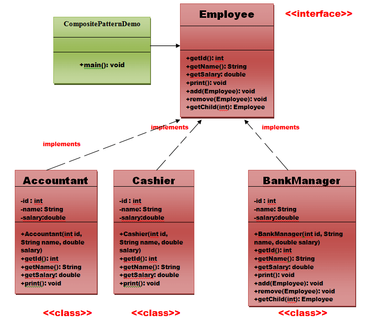

#### Implementation of above UML:


- Step 1 Create an **Employee** interface that will be treated as a **component**.

*File: Employee.java*
```java
// this is the Employee interface i.e. Component.  
public interface Employee {
    public int getId();

    public String getName();

    public double getSalary();

    public void print();

    public void add(Employee employee);

    public void remove(Employee employee);

    public Employee getChild(int i);
}// End of the Employee interface.  
```

- Step 2 Create a **BankManager** class that will be treated as a **Composite** and implements **Employee** interface.

*File: BankManager.java*
```java
// this is the BankManager class i.e. Composite.  

import java.util.ArrayList;
import java.util.Iterator;
import java.util.List;

public class BankManager implements Employee {
    private int id;
    private String name;
    private double salary;

    public BankManager(int id, String name, double salary) {
        this.id = id;
        this.name = name;
        this.salary = salary;
    }

    List<Employee> employees = new ArrayList<Employee>();

    @Override
    public void add(Employee employee) {
        employees.add(employee);
    }

    @Override
    public Employee getChild(int i) {
        return employees.get(i);
    }

    @Override
    public void remove(Employee employee) {
        employees.remove(employee);
    }

    @Override
    public int getId() {
        return id;
    }

    @Override
    public String getName() {
        return name;
    }

    @Override
    public double getSalary() {
        return salary;
    }

    @Override
    public void print() {
        System.out.println("==========================");
        System.out.println("Id =" + getId());
        System.out.println("Name =" + getName());
        System.out.println("Salary =" + getSalary());
        System.out.println("==========================");

        Iterator<Employee> it = employees.iterator();

        while (it.hasNext()) {
            Employee employee = it.next();
            employee.print();
        }
    }
}// End of the BankManager class.  
```

- Step 3 Create a **Cashier** class that will be treated as a **leaf** and it will implement to the **Employee** interface.

*File: Cashier.java*
```java
public class Cashier implements Employee {
    /* 
         In this class,there are many methods which are not applicable to cashier because 
         it is a leaf node. 
     */
    private int id;
    private String name;
    private double salary;

    public Cashier(int id, String name, double salary) {
        this.id = id;
        this.name = name;
        this.salary = salary;
    }

    @Override
    public void add(Employee employee) {
        //this is leaf node so this method is not applicable to this class.  
    }

    @Override
    public Employee getChild(int i) {
        //this is leaf node so this method is not applicable to this class.  
        return null;
    }

    @Override
    public int getId() {
        // TODO Auto-generated method stub  
        return id;
    }

    @Override
    public String getName() {
        return name;
    }

    @Override
    public double getSalary() {
        return salary;
    }

    @Override
    public void print() {
        System.out.println("==========================");
        System.out.println("Id =" + getId());
        System.out.println("Name =" + getName());
        System.out.println("Salary =" + getSalary());
        System.out.println("==========================");
    }

    @Override
    public void remove(Employee employee) {
        //this is leaf node so this method is not applicable to this class.  
    }
}  
```

- Step 4 Create a **Accountant** class that will also be treated as a **leaf** and it will implement to the **Employee** interface.

*File: Accountant.java*
```java
public class Accountant implements Employee {
    /* 
        In this class,there are many methods which are not applicable to cashier because 
        it is a leaf node. 
    */
    private int id;
    private String name;
    private double salary;

    public Accountant(int id, String name, double salary) {
        this.id = id;
        this.name = name;
        this.salary = salary;
    }

    @Override
    public void add(Employee employee) {
        //this is leaf node so this method is not applicable to this class.  
    }

    @Override
    public Employee getChild(int i) {
        //this is leaf node so this method is not applicable to this class.  
        return null;
    }

    @Override
    public int getId() {
        // TODO Auto-generated method stub  
        return id;
    }

    @Override
    public String getName() {
        return name;
    }

    @Override
    public double getSalary() {
        return salary;
    }

    @Override
    public void print() {
        System.out.println("=========================");
        System.out.println("Id =" + getId());
        System.out.println("Name =" + getName());
        System.out.println("Salary =" + getSalary());
        System.out.println("=========================");
    }

    @Override
    public void remove(Employee employee) {
        //this is leaf node so this method is not applicable to this class.  
    }
}
```

- Step 5 Create a **CompositePatternDemo** class that will also be treated as a **Client** and ii will use the **Employee** interface.

*File: CompositePatternDemo.java*
```java
public class CompositePatternDemo {
    public static void main(String args[]) {
        Employee emp1 = new Cashier(101, "Sohan Kumar", 20000.0);
        Employee emp2 = new Cashier(102, "Mohan Kumar", 25000.0);
        Employee emp3 = new Accountant(103, "Seema Mahiwal", 30000.0);
        Employee manager1 = new BankManager(100, "Ashwani Rajput", 100000.0);

        manager1.add(emp1);
        manager1.add(emp2);
        manager1.add(emp3);
        manager1.print();
    }
}
```
#### [download this composite pattern Example](src/compositepattern.zip)

#### Output
```java
==========================  
Id =100  
Name =Ashwani Rajput  
Salary =100000.0  
==========================  
==========================  
Id =101  
Name =Sohan Kumar  
Salary =20000.0  
==========================  
==========================  
Id =102  
Name =Mohan Kumar  
Salary =25000.0  
==========================  
=========================  
Id =103  
Name =Seema Mahiwal  
Salary =30000.0  
=========================  
```

### 2.4 Decorator Pattern

A Decorator Pattern says that just **"attach a flexible additional responsibilities to an object dynamically"**.

In other words, The Decorator Pattern uses composition instead of inheritance to extend the functionality of an object at runtime.

The Decorator Pattern is also known as **Wrapper**.

#### Advantage of Decorator Pattern

- It provides greater flexibility than static inheritance.
- It enhances the extensibility of the object, because changes are made by coding new classes.
- It simplifies the coding by allowing you to develop a series of functionality from targeted classes instead of coding all of the behavior into the object.

#### Usage of Decorator Pattern

It is used:

- When you want to transparently and dynamically add responsibilities to objects without affecting other objects.
- When you want to add responsibilities to an object that you may want to change in future.
- Extending functionality by sub-classing is no longer practical.

#### UML for Decorator Pattern

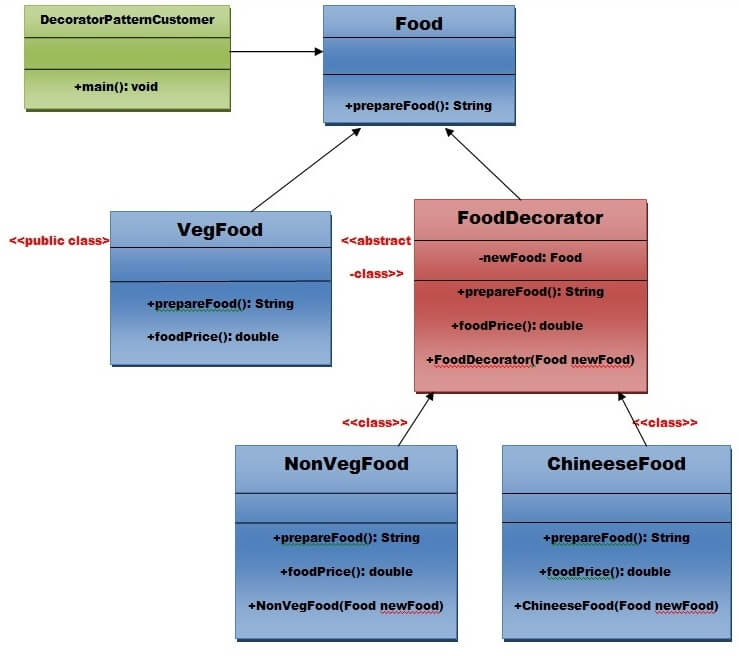

#### Implemenation of above Decorator Pattern

- Step 1:Create a Food interface.

*File: Food.java*
```java
public interface Food {
    public String prepareFood();

    public double foodPrice();
}// End of the Food interface.  
```

- Step 2: Create a **VegFood** class that will implements the **Food** interface and override its all methods.

*File: VegFood.java*
```java
public class VegFood implements Food {
    public String prepareFood() {
        return "Veg Food";
    }

    public double foodPrice() {
        return 50.0;
    }
}
```

- Step 3:Create a **FoodDecorator** abstract class that will implements the **Food** interface and override it's all methods and it has the ability to decorate some more foods.

*File: FoodDecorator.java*

```java
public abstract class FoodDecorator implements Food {
    private Food newFood;

    public FoodDecorator(Food newFood) {
        this.newFood = newFood;
    }

    @Override
    public String prepareFood() {
        return newFood.prepareFood();
    }

    public double foodPrice() {
        return newFood.foodPrice();
    }
}  
```

- Step 4:Create a **NonVegFood** concrete class that will extend the **FoodDecorator** class and override it's all methods.

*File: NonVegFood.java*
```java
public class NonVegFood extends FoodDecorator {
    public NonVegFood(Food newFood) {
        super(newFood);
    }

    public String prepareFood() {
        return super.prepareFood() + " With Roasted Chiken and Chiken Curry  ";
    }

    public double foodPrice() {
        return super.foodPrice() + 150.0;
    }
}
```

- Step 5:Create a **ChineeseFood** concrete class that will extend the **FoodDecorator** class and override it's all methods.

*File: ChineeseFood.java*
```java
public class ChineeseFood extends FoodDecorator {
    public ChineeseFood(Food newFood) {
        super(newFood);
    }

    public String prepareFood() {
        return super.prepareFood() + " With Fried Rice and Manchurian  ";
    }

    public double foodPrice() {
        return super.foodPrice() + 65.0;
    }
}
```

- Step 6:Create a **DecoratorPatternCustomer** class that will use **Food** interface to use which type of food customer wants means (Decorates).

*File: DecoratorPatternCustomer.java*
```java
import java.io.BufferedReader;
import java.io.IOException;
import java.io.InputStreamReader;

public class DecoratorPatternCustomer {
    private static int choice;

    public static void main(String args[]) throws NumberFormatException, IOException {
        do {
            System.out.print("========= Food Menu ============ \n");
            System.out.print("            1. Vegetarian Food.   \n");
            System.out.print("            2. Non-Vegetarian Food.\n");
            System.out.print("            3. Chineese Food.         \n");
            System.out.print("            4. Exit                        \n");
            System.out.print("Enter your choice: ");
            BufferedReader br = new BufferedReader(new InputStreamReader(System.in));
            choice = Integer.parseInt(br.readLine());
            switch (choice) {
                case 1: {
                    VegFood vf = new VegFood();
                    System.out.println(vf.prepareFood());
                    System.out.println(vf.foodPrice());
                }
                break;

                case 2: {
                    Food f1 = new NonVegFood((Food) new VegFood());
                    System.out.println(f1.prepareFood());
                    System.out.println(f1.foodPrice());
                }
                break;
                case 3: {
                    Food f2 = new ChineeseFood((Food) new VegFood());
                    System.out.println(f2.prepareFood());
                    System.out.println(f2.foodPrice());
                }
                break;

                default: {
                    System.out.println("Other than these no food available");
                }
                return;
            }//end of switch  

        } while (choice != 4);
    }
}
```
#### [download this Decorator Pattern Example](src/decoratorpattern.zip)

#### Output

```java
========= Food Menu ============  
            1. Vegetarian Food.  
            2. Non-Vegetarian Food.  
            3. Chineese Food.  
            4. Exit  
Enter your choice: 1  
Veg Food  
50.0  
========= Food Menu ============  
            1. Vegetarian Food.  
            2. Non-Vegetarian Food.  
            3. Chineese Food.  
            4. Exit  
Enter your choice: 2  
Veg Food With Roasted Chiken and Chiken Curry  
200.0  
========= Food Menu ============  
            1. Vegetarian Food.  
            2. Non-Vegetarian Food.  
            3. Chineese Food.  
            4. Exit  
Enter your choice: 3  
Veg Food With Fried Rice and Manchurian  
115.0  
========= Food Menu ============  
            1. Vegetarian Food.  
            2. Non-Vegetarian Food.  
            3. Chineese Food.  
            4. Exit  
Enter your choice: 4  
Other than these no food available  
```

### 2.5 Facade Pattern

A Facade Pattern says that just **"just provide a unified and simplified interface to a set of interfaces in a subsystem, therefore it hides the complexities of the subsystem from the client"**.

In other words, Facade Pattern describes a higher-level interface that makes the sub-system easier to use.

Practically, every **Abstract Factory** is a type of Facade.

#### Advantage of Facade Pattern
- It shields the clients from the complexities of the sub-system components.
- It promotes loose coupling between subsystems and its clients.

#### Usage of Facade Pattern

It is used:

- When you want to provide simple interface to a complex sub-system.
- When several dependencies exist between clients and the implementation classes of an abstraction.

#### Example of Facade Pattern
Let's understand the example of facade design pattern by the above UML diagram.

#### UML for Facade Pattern


#### Implementation of above UML

- Step 1 Create a **MobileShop** interface.

*File: MobileShop.java*
```java
public interface MobileShop {
    public void modelNo();

    public void price();
}
```

- Step 2 Create a **Iphone** implementation class that will implement **Mobileshop** interface.
*File: Iphone.java*
```java
public class Iphone implements MobileShop {
    @Override
    public void modelNo() {
        System.out.println(" Iphone 6 ");
    }

    @Override
    public void price() {
        System.out.println(" Rs 65000.00 ");
    }
} 
```

- Step 3 Create a **Samsung** implementation class that will implement **Mobileshop** interface.
*File: Samsung.java*
```java
public class Samsung implements MobileShop {
    @Override
    public void modelNo() {
        System.out.println(" Samsung galaxy tab 3 ");
    }

    @Override
    public void price() {
        System.out.println(" Rs 45000.00 ");
    }
}
```

- Step 4 Create a **Blackberry** implementation class that will implement **Mobileshop** interface.

*File: Blackberry.java*
```java
public class Blackberry implements MobileShop {
    @Override
    public void modelNo() {
        System.out.println(" Blackberry Z10 ");
    }

    @Override
    public void price() {
        System.out.println(" Rs 55000.00 ");
    }
}
```

- Step 5 Create a **ShopKeeper** concrete class that will use **MobileShop** interface.
*File: ShopKeeper.java*

```java
public class ShopKeeper {
    private MobileShop iphone;
    private MobileShop samsung;
    private MobileShop blackberry;

    public ShopKeeper() {
        iphone = new Iphone();
        samsung = new Samsung();
        blackberry = new Blackberry();
    }

    public void iphoneSale() {
        iphone.modelNo();
        iphone.price();
    }

    public void samsungSale() {
        samsung.modelNo();
        samsung.price();
    }

    public void blackberrySale() {
        blackberry.modelNo();
        blackberry.price();
    }
}
```

- Step 6 Now, Creating a client that can purchase the mobiles from **MobileShop** through **ShopKeeper**.
*File: FacadePatternClient.java*
```java
import java.io.BufferedReader;
import java.io.IOException;
import java.io.InputStreamReader;

public class FacadePatternClient {
    private static int choice;

    public static void main(String args[]) throws NumberFormatException, IOException {
        do {
            System.out.print("========= Mobile Shop ============ \n");
            System.out.print("            1. IPHONE.              \n");
            System.out.print("            2. SAMSUNG.              \n");
            System.out.print("            3. BLACKBERRY.            \n");
            System.out.print("            4. Exit.                     \n");
            System.out.print("Enter your choice: ");

            BufferedReader br = new BufferedReader(new InputStreamReader(System.in));
            choice = Integer.parseInt(br.readLine());
            ShopKeeper sk = new ShopKeeper();

            switch (choice) {
                case 1: {
                    sk.iphoneSale();
                }
                break;
                case 2: {
                    sk.samsungSale();
                }
                break;
                case 3: {
                    sk.blackberrySale();
                }
                break;
                default: {
                    System.out.println("Nothing You purchased");
                }
                return;
            }

        } while (choice != 4);
    }
}
```

#### [download this example](src/facadepattern.zip)

#### Output
```java
========= Mobile Shop ============  
            1. IPHONE.  
            2. SAMSUNG.  
            3. BLACKBERRY.  
            4. Exit.  
Enter your choice: 1  
 Iphone 6  
 Rs 65000.00  
========= Mobile Shop ============  
            1. IPHONE.  
            2. SAMSUNG.  
            3. BLACKBERRY.  
            4. Exit.  
Enter your choice: 2  
 Samsung galaxy tab 3  
 Rs 45000.00  
========= Mobile Shop ============  
            1. IPHONE.  
            2. SAMSUNG.  
            3. BLACKBERRY.  
            4. Exit.  
Enter your choice: 3  
 Blackberry Z10  
 Rs 55000.00  
========= Mobile Shop ============  
            1. IPHONE.  
            2. SAMSUNG.  
            3. BLACKBERRY.  
            4. Exit.  
Enter your choice: 4  
Nothing You purchased
```

### 2.6 Flyweight Pattern

A Flyweight Pattern says that just **"to reuse already existing similar kind of objects by storing them and create new object when no matching object is found"**.

#### Advantage of Flyweight Pattern
- It reduces the number of objects.
- It reduces the amount of memory and storage devices required if the objects are persisted

#### Usage of Flyweight Pattern
- When an application uses number of objects
- When the storage cost is high because of the quantity of objects.
- When the application does not depend on object identity.

#### UML Flyweight Pattern

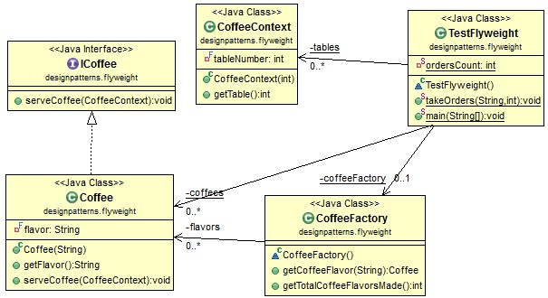

#### Flyweight Implementation Sample

- Create **Coffe** Context
```java
// Flyweight object interface
interface ICoffee {
    public void serveCoffee(CoffeeContext context);
}
```

```java
// Concrete Flyweight object  
class Coffee implements ICoffee {
    private final String flavor;

    public Coffee(String newFlavor) {
        this.flavor = newFlavor;
        System.out.println("Coffee is created! - " + flavor);
    }

    public String getFlavor() {
        return this.flavor;
    }

    public void serveCoffee(CoffeeContext context) {
        System.out.println("Serving " + flavor + " to table " + context.getTable());
    }
}


```

```java
// A context, here is table number
class CoffeeContext {
    private final int tableNumber;

    public CoffeeContext(int tableNumber) {
        this.tableNumber = tableNumber;
    }

    public int getTable() {
        return this.tableNumber;
    }
}
```

- CoffeeFactory: it only create a new coffee when necessary.
```java
//The FlyweightFactory!
class CoffeeFactory {
 
    private HashMap<String, Coffee> flavors = new HashMap<String, Coffee>();
 
    public Coffee getCoffeeFlavor(String flavorName) {
        Coffee flavor = flavors.get(flavorName);
        if (flavor == null) {
            flavor = new Coffee(flavorName);
            flavors.put(flavorName, flavor);
        }
        return flavor;
    }
 
    public int getTotalCoffeeFlavorsMade() {
        return flavors.size();
    }
}
```

- Waitress serving coffee
```java
public class Waitress {
   //coffee array
   private static Coffee[] coffees = new Coffee[20];
   //table array
   private static CoffeeContext[] tables = new CoffeeContext[20];
   private static int ordersCount = 0;
   private static CoffeeFactory coffeeFactory;
 
   public static void takeOrder(String flavorIn, int table) {
	   coffees[ordersCount] = coffeeFactory.getCoffeeFlavor(flavorIn);
       tables[ordersCount] = new CoffeeContext(table);
       ordersCount++;
   }
 
   public static void main(String[] args) {
	   coffeeFactory = new CoffeeFactory();
 
       takeOrder("Cappuccino", 2);
       takeOrder("Cappuccino", 2);
       takeOrder("Regular Coffee", 1);
       takeOrder("Regular Coffee", 2);
       takeOrder("Regular Coffee", 3);
       takeOrder("Regular Coffee", 4);
       takeOrder("Cappuccino", 4);
       takeOrder("Cappuccino", 5);
       takeOrder("Regular Coffee", 3);
       takeOrder("Cappuccino", 3);
 
       for (int i = 0; i < ordersCount; ++i) {
    	   coffees[i].serveCoffee(tables[i]);
       }
 
       System.out.println("\nTotal Coffee objects made: " +  coffeeFactory.getTotalCoffeeFlavorsMade());
   }
}
```

#### Check out the output below, coffee is served to 10 tables, but only 2 coffees are created ever!

```java
Coffee is created! - Cappuccino
Coffee is created! - Regular Coffee
Serving Cappuccino to table 2
Serving Cappuccino to table 2
Serving Regular Coffee to table 1
Serving Regular Coffee to table 2
Serving Regular Coffee to table 3
Serving Regular Coffee to table 4
Serving Cappuccino to table 4
Serving Cappuccino to table 5
Serving Regular Coffee to table 3
Serving Cappuccino to table 3

Total Coffee objects made: 2
```

### 2.7 Proxy Pattern

Simply, proxy means an object representing another object.

According to GoF, a Proxy Pattern **"provides the control for accessing the original object"**.

So, we can perform many operations like hiding the information of original object, on demand loading etc.

Proxy pattern is also known as **Surrogate or Placeholder**.

:book: `RMI API uses proxy design pattern. Stub and Skeleton are two proxy objects used in RMI.`


#### Advantage of Proxy Pattern
- It provides the protection to the original object from the outside world.

#### Usage of Proxy Pattern

It is used:

- It can be used in **Virtual Proxy** scenario: Consider a situation where there is multiple database call to extract huge size image. Since this is an expensive operation so here we can use the proxy pattern which would create multiple proxies and point to the huge size memory consuming object for further processing. The real object gets created only when a client first requests/accesses the object and after that we can just refer to the proxy to reuse the object. This avoids duplication of the object and hence saving memory.
- It can be used in **Protective Proxy** scenario: It acts as an authorization layer to verify that whether the actual user has access the appropriate content or not. For example, a proxy server which provides restriction on internet access in office. Only the websites and contents which are valid will be allowed and the remaining ones will be blocked.
- It can be used in **Remote Proxy** scenario: A remote proxy can be thought about the stub in the RPC call. The remote proxy provides a local representation of the object which is present in the different address location. Another example can be providing interface for remote resources such as web service or REST resources.
- It can be used in **Smart Proxy** scenario: A smart proxy provides additional layer of security by interposing specific actions when the object is accessed. For example, to check whether the real object is locked or not before accessing it so that no other objects can change it.- -


#### Example of Proxy Pattern
Let's understand the example of proxy design pattern by the above UML diagram.

#### UML for Proxy Pattern

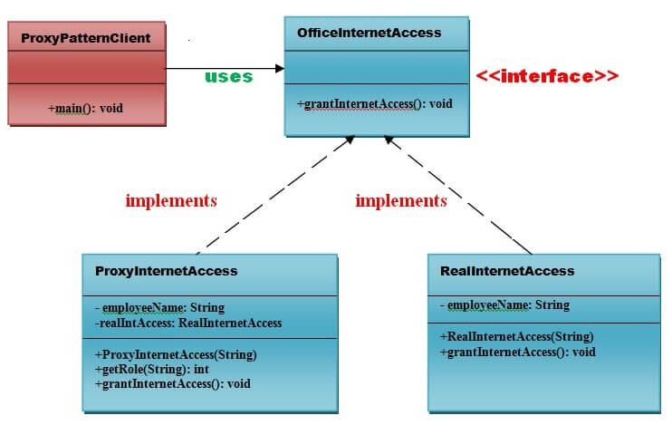

#### Implementation of above UML

- Step 1 Create an OfficeInternetAccess interface.

```java
public interface OfficeInternetAccess {
    public void grantInternetAccess();
} 
```

- Step 2 Create a **RealInternetAccess** class that will implement **OfficeInternetAccess** interface for granting the permission to the specific employee.

*File: RealInternetAccess.java*
```java
public class RealInternetAccess implements OfficeInternetAccess {
    private String employeeName;

    public RealInternetAccess(String empName) {
        this.employeeName = empName;
    }

    @Override
    public void grantInternetAccess() {
        System.out.println("Internet Access granted for employee: " + employeeName);
    }
}
```

- Step 3 Create a **ProxyInternetAccess** class that will implement **OfficeInternetAccess** interface for providing the object of **RealInternetAccess** class.

*File: ProxyInternetAccess.java*
```java
public class ProxyInternetAccess implements OfficeInternetAccess {
    private String employeeName;
    private RealInternetAccess realaccess;

    public ProxyInternetAccess(String employeeName) {
        this.employeeName = employeeName;
    }

    @Override
    public void grantInternetAccess() {
        if (getRole(employeeName) > 4) {
            realaccess = new RealInternetAccess(employeeName);
            realaccess.grantInternetAccess();
        } else {
            System.out.println("No Internet access granted. Your job level is below 5");
        }
    }

    public int getRole(String emplName) {
        // Check role from the database based on Name and designation  
        // return job level or job designation.  
        return 9;
    }
}
```

- Step 4 Now, Create a **ProxyPatternClient** class that can access the internet actually.

*File: ProxyPatternClient.java*

```java
public class ProxyPatternClient {
    public static void main(String[] args) {
        OfficeInternetAccess access = new ProxyInternetAccess("Ashwani Rajput");
        access.grantInternetAccess();
    }
}
```

#### [download Proxy Pattern Sample](src/proxypattern.zip)

#### Sample Output

```java
No Internet access granted. Your job level is below 5  
```

## 3. Behavioral Design Pattern
Behavioral design patterns are concerned with the **interaction and responsibility of objects**.

In these design patterns,**the interaction between the objects should be in such a way that they can easily talk to each other and still should be loosely coupled**.

That means the implementation and the client should be loosely coupled in order to avoid hard coding and dependencies.

There are 12 types of structural design patterns:
- 1) [Chain Of Responsibility Pattern](#31-chain-of-responsibility-pattern-1)
- 2) [Command Pattern](#32-command-pattern-1)
- 3) [Interpreter Pattern](#33-interpreter-pattern-1)
- 4) [Iterator Pattern](#34-iterator-pattern-1)
- 5) [Mediator Pattern](#35-mediator-pattern-1)
- 6) [Memento Pattern](#36-memento-pattern-1)
- 7) [Observer Pattern](#37-observer-pattern-1)
- 8) [State Pattern](#38-state-pattern-1)
- 9) [Strategy Pattern](#39-strategy-pattern-1)
- 10) [Template Pattern](#310-template-pattern-1)
- 11) [Visitor Pattern](#311-visitor-pattern-1)


### 3.1 Chain Of Responsibility Pattern

In chain of responsibility, sender sends a request to a chain of objects. The request can be handled by any object in the chain.

A Chain of Responsibility Pattern says that just **"avoid coupling the sender of a request to its receiver by giving multiple objects a chance to handle the request"**. For example, an ATM uses the Chain of Responsibility design pattern in money giving process.

In other words, we can say that normally each receiver contains reference of another receiver. If one object cannot handle the request then it passes the same to the next receiver and so on.

#### Advantage of Chain of Responsibility Pattern

- It reduces the coupling.
- It adds flexibility while assigning the responsibilities to objects.
- It allows a set of classes to act as one; events produced in one class can be sent to other handler classes with the help of composition.

#### Usage of Chain of Responsibility Pattern
It is used:

- When more than one object can handle a request and the handler is unknown.
- When the group of objects that can handle the request must be specified in dynamic way.

#### Example of Chain of Responsibility Pattern

Let's understand the example of Chain of Responsibility Pattern by the above UML diagram.

#### UML for Chain of Responsibility Pattern
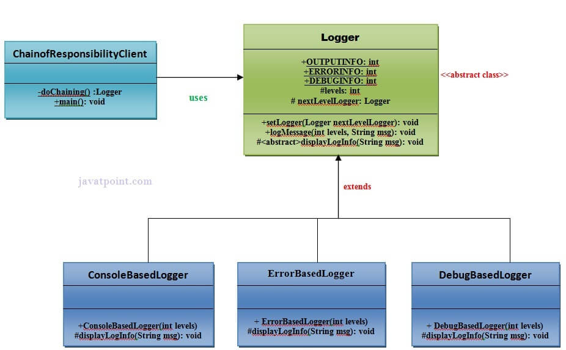

#### Implementation of above UML

- Step 1 Create a **Logger** abstract class.
```java
public abstract class Logger {
    public static int OUTPUTINFO = 1;
    public static int ERRORINFO = 2;
    public static int DEBUGINFO = 3;
    protected int levels;
    protected Logger nextLevelLogger;

    public void setNextLevelLogger(Logger nextLevelLogger) {
        this.nextLevelLogger = nextLevelLogger;
    }

    public void logMessage(int levels, String msg) {
        if (this.levels <= levels) {
            displayLogInfo(msg);
        }
        if (nextLevelLogger != null) {
            nextLevelLogger.logMessage(levels, msg);
        }
    }

    protected abstract void displayLogInfo(String msg);
}
```

- Step 2 Create a **ConsoleBasedLogger** class.

*File: ConsoleBasedLogger.java*
```java
public class ConsoleBasedLogger extends Logger {
    public ConsoleBasedLogger(int levels) {
        this.levels = levels;
    }

    @Override
    protected void displayLogInfo(String msg) {
        System.out.println("CONSOLE LOGGER INFO: " + msg);
    }
}
```

- Step 3 Create a **DebugBasedLogger** class.
*File: DebugBasedLogger.java*
```java
public class DebugBasedLogger extends Logger {
    public DebugBasedLogger(int levels) {
        this.levels = levels;
    }

    @Override
    protected void displayLogInfo(String msg) {
        System.out.println("DEBUG LOGGER INFO: " + msg);
    }
}// End of the DebugBasedLogger class. 
```

- Step 4 Create a **ErrorBasedLogger** class.

*File: ErrorBasedLogger.java*
```java
public class ErrorBasedLogger extends Logger {
    public ErrorBasedLogger(int levels) {
        this.levels = levels;
    }

    @Override
    protected void displayLogInfo(String msg) {
        System.out.println("ERROR LOGGER INFO: " + msg);
    }
}// End of the ErrorBasedLogger class.
```

- Step 5 Create a **ChainOfResponsibilityClient** class.

*File: ChainofResponsibilityClient.java*
```java
public class ChainofResponsibilityClient {
    private static Logger doChaining() {
        Logger consoleLogger = new ConsoleBasedLogger(Logger.OUTPUTINFO);

        Logger errorLogger = new ErrorBasedLogger(Logger.ERRORINFO);
        consoleLogger.setNextLevelLogger(errorLogger);

        Logger debugLogger = new DebugBasedLogger(Logger.DEBUGINFO);
        errorLogger.setNextLevelLogger(debugLogger);

        return consoleLogger;
    }

    public static void main(String args[]) {
        Logger chainLogger = doChaining();

        chainLogger.logMessage(Logger.OUTPUTINFO, "Enter the sequence of values ");
        chainLogger.logMessage(Logger.ERRORINFO, "An error is occured now");
        chainLogger.logMessage(Logger.DEBUGINFO, "This was the error now debugging is compeled");
    }
}
```

#### [download this example](src/chainofresponsibility.zip)

#### Output
```java
bilityClient  
CONSOLE LOGGER INFO: Enter the sequence of values  
CONSOLE LOGGER INFO: An error is occured now  
ERROR LOGGER INFO: An error is occured now  
CONSOLE LOGGER INFO: This was the error now debugging is compeled  
ERROR LOGGER INFO: This was the error now debugging is compeled  
DEBUG LOGGER INFO: This was the error now debugging is compeled  
```

### 3.2 Command Pattern

A Command Pattern says that **"encapsulate a request under an object as a command and pass it to invoker object. Invoker object looks for the appropriate object which can handle this command and pass the command to the corresponding object and that object executes the command"**.

It is also known as **Action or Transaction**.

#### Advantage of command pattern
- It separates the object that invokes the operation from the object that actually performs the operation.
- It makes easy to add new commands, because existing classes remain unchanged.

#### Usage of command pattern

It is used:
- When you need parameterize objects according to an action perform.
- When you need to create and execute requests at different times.
- When you need to support rollback, logging or transaction functionality.

#### Example of command pattern
Let's understand the example of adapter design pattern by the above UML diagram.

#### UML for command pattern

##### These are the following participants of the Command Design pattern:
- **Command** This is an interface for executing an operation.
- **ConcreteCommand** This class extends the Command interface and implements the execute method. This class creates a binding between the action and the receiver.
- **Client** This class creates the ConcreteCommand class and associates it with the receiver.
- **Invoker** This class asks the command to carry out the request.
- **Receiver** This class knows to perform the operation.


#### Implementation of above UML

- Step 1 Create a **ActionListernerCommand** interface that will act as a Command.
*File: ActionListenerCommand.java*
```java
public interface ActionListenerCommand {  
    public void execute();  
} 
```

- Step 2 Create a Document class that will act as a Receiver.
*File: Document.java*
```java
public class Document {  
          public void open(){  
           System.out.println("Document Opened");  
       }  
       public void save(){  
           System.out.println("Document Saved");  
       }  
}
```

- Step 3 Create a **ActionOpen** class that will act as an ConcreteCommand.

*File: ActionOpen.java*
```java
public class ActionOpen implements ActionListenerCommand{  
    private Document doc;  
    public ActionOpen(Document doc) {  
        this.doc = doc;  
    }  
    @Override  
    public void execute() {  
        doc.open();  
    }  
} 
```

- Step 4 Create a **ActionSave** class that will act as an ConcreteCommand.

*File: AdapterPatternDemo.java*
```java
public class ActionSave implements ActionListenerCommand{  
   private Document doc;  
   public ActionSave(Document doc) {  
        this.doc = doc;  
    }  
    @Override  
    public void execute() {  
        doc.save();  
    }  
} 
```

- Step 5 Create a **MenuOptions** class that will act as an Invoker.

*File: ActionSave.java*
```java
public class ActionSave implements ActionListenerCommand{  
   private Document doc;  
    public ActionSave(Document doc) {  
        this.doc = doc;  
    }  
    @Override  
    public void execute() {  
        doc.save();  
    }  
} 
```

- Step 6 Create a **CommanPatternClient** class that will act as a Client.

*File: AdapterPatternDemo.java*
```java
public class CommandPatternClient {  
    public static void main(String[] args) {  
        Document doc = new Document();  
          
        ActionListenerCommand clickOpen = new ActionOpen(doc);  
        ActionListenerCommand clickSave = new ActionSave(doc);  
          
        MenuOptions menu = new MenuOptions(clickOpen, clickSave);  
          
        menu.clickOpen();  
        menu.clickSave();  
   }  
}
```

#### [download this example](src/commandpattern.zip)

#### Output
```
Document Opened  
Document Saved
```

### 3.3 Interpreter Pattern

An Interpreter Pattern says that **"to define a representation of grammar of a given language, along with an interpreter that uses this representation to interpret sentences in the language"**.

Basically the Interpreter pattern has limited area where it can be applied. We can discuss the Interpreter pattern only in terms of formal grammars but in this area there are better solutions that is why it is not frequently used.

This pattern can applied for parsing the expressions defined in simple grammars and sometimes in simple rule engines.

:book: `SQL Parsing uses interpreter design pattern`.

#### Advantage of Interpreter Pattern
- It is easier to change and extend the grammar.
- Implementing the grammar is straightforward.


#### Usage of Interpreter pattern:
It is used:

- When the grammar of the language is not complicated.
- When the efficiency is not a priority.

#### Example of Interpreter Pattern
Let's understand the example of Interpreter Pattern by the above UML diagram.

#### UML for Interpreter Pattern:
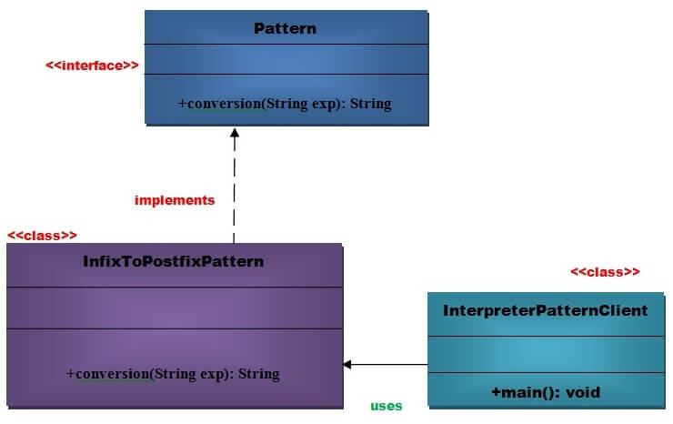

- Step 1 Create a Pattern interface.
```java
public interface Pattern {
    public String conversion(String exp);
}
```

- Step 2 Create a **InfixToPostfixPattern** class that will allow what kind of pattern you want to convert.

*File: InfixToPostfixPattern.java*
```java
import java.util.Stack;

public class InfixToPostfixPattern implements Pattern {
    @Override
    public String conversion(String exp) {
        int priority = 0;// for the priority of operators.  
        String postfix = "";
        Stack<Character> s1 = new Stack<Character>();
        for (int i = 0; i < exp.length(); i++) {
            char ch = exp.charAt(i);
            if (ch == '+' || ch == '-' || ch == '*' || ch == '/' || ch == '%') {
                // check the precedence  
                if (s1.size() <= 0)
                    s1.push(ch);
            } else {
                Character chTop = (Character) s1.peek();
                if (chTop == '*' || chTop == '/')
                    priority = 1;
                else
                    priority = 0;
                if (priority == 1) {
                    if (ch == '*' || ch == '/' || ch == '%') {
                        postfix += s1.pop();
                        i--;
                    } else { // Same  
                        postfix += s1.pop();
                        i--;
                    }
                } else {
                    if (ch == '+' || ch == '-') {
                        postfix += s1.pop();
                        s1.push(ch);
                    } else
                        s1.push(ch);
                }
            }
        }  
           else
        {
            postfix += ch;
        }
    }

    int len = s1.size();  
        for(
    int j = 0;
    j<len;j++)
    postfix +=s1.pop();  
        return postfix;

}   
}// End of the InfixToPostfixPattern class.  
```

- Step 3 Create a **InterpreterPatternClient** class that will use **InfixToPostfix** Conversion.

*File: InterpreterPatternClient.java*

```java
public class InterpreterPatternClient {
    public static void main(String[] args) {
        String infix = "a+b*c";

        InfixToPostfixPattern ip = new InfixToPostfixPattern();

        String postfix = ip.conversion(infix);
        System.out.println("Infix:   " + infix);
        System.out.println("Postfix: " + postfix);
    }
}
```

#### [download this example](src/interpreterpattern.zip)
#### Output
```java
Infix:   a+b*c  
Postfix: abc*+ 
```

### 3.4 Iterator Pattern

According to GoF, Iterator Pattern is used "**to access the elements of an aggregate object sequentially without exposing its underlying implementation**".

The Iterator pattern is also known as Cursor.

In collection framework, we are now using Iterator that is preferred over Enumeration.

:book: `java.util.Iterator interface uses Iterator Design Pattern`.

#### Advantage of Iterator Pattern
- It supports variations in the traversal of a collection.
- It simplifies the interface to the collection.


#### Usage of Iterator Pattern:
It is used:

- When you want to access a collection of objects without exposing its internal representation.
- When there are multiple traversals of objects need to be supported in the collection.


#### Example of Iterator Pattern
Let's understand the example of iterator pattern pattern by the above UML diagram.

##### UML for Iterator Pattern:

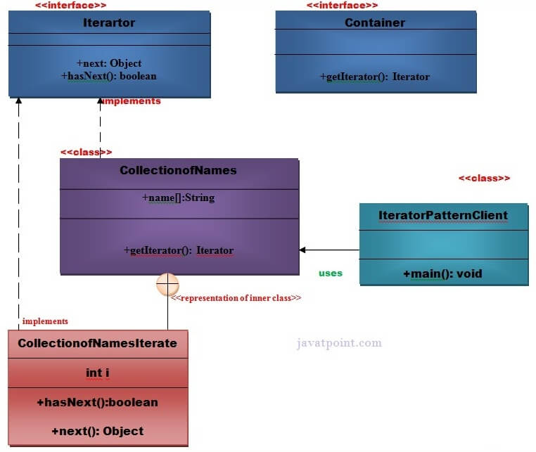

#### Implementation of above UML
- Step 1 Create a Iterartor interface.

```java
public interface Iterator {
    public boolean hasNext();

    public Object next();
}
```

- Step 2 Create a Container interface.

```java
public interface Container {
    public Iterator getIterator();
}// End of the Iterator interface.
```

- Step 3 Create a **CollectionofNames** class that will implement **Container** interface.

*File: CollectionofNames.java*
```java
public class CollectionofNames implements Container {
    public String name[] = {"Ashwani Rajput", "Soono Jaiswal", "Rishi Kumar", "Rahul Mehta", "Hemant Mishra"};

    @Override
    public Iterator getIterator() {
        return new CollectionofNamesIterate();
    }

    private class CollectionofNamesIterate implements Iterator {
        int i;

        @Override
        public boolean hasNext() {
            if (i < name.length) {
                return true;
            }
            return false;
        }

        @Override
        public Object next() {
            if (this.hasNext()) {
                return name[i++];
            }
            return null;
        }
    }
}  
```

- Step 4 Create a **IteratorPatternDemo** class.

*File: IteratorPatternDemo.java*
```java
public class IteratorPatternDemo {
    public static void main(String[] args) {
        CollectionofNames cmpnyRepository = new CollectionofNames();

        for (Iterator iter = cmpnyRepository.getIterator(); iter.hasNext(); ) {
            String name = (String) iter.next();
            System.out.println("Name : " + name);
        }
    }
}
```

#### [download this example](src/iteratorpattern.zip)
#### Output
```java
Name : Ashwani Rajput  
Name : Soono Jaiswal  
Name : Rishi Kumar  
Name : Rahul Mehta  
Name : Hemant Mishra  
```

### 3.5 Mediator Pattern
A Mediator Pattern says that "**to define an object that encapsulates how a set of objects interact**".

I will explain the Mediator pattern by considering a problem. When we begin with development, we have a few classes and these classes interact with each other producing results. Now, consider slowly, the logic becomes more complex when functionality increases. Then what happens? We add more classes and they still interact with each other but it gets really difficult to maintain this code now. So, Mediator pattern takes care of this problem.

Mediator pattern is used to reduce communication complexity between multiple objects or classes. This pattern provides a mediator class which normally handles all the communications between different classes and supports easy maintainability of the code by loose coupling.

#### Benefits:
- It decouples the number of classes.
- It simplifies object protocols.
- It centralizes the control.
- The individual components become simpler and much easier to deal with because they don't need to pass messages to one another.
- The components don't need to contain logic to deal with their intercommunication and therefore, they are more generic.

#### Usage:
- It is commonly used in message-based systems likewise chat applications.
- When the set of objects communicate in complex but in well-defined ways.

#### UML for Mediator Pattern
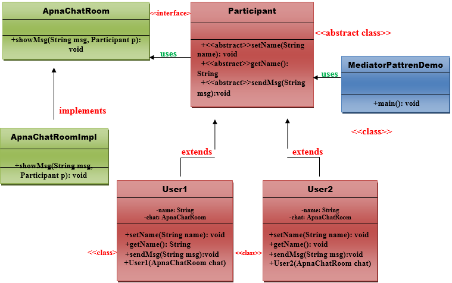

##### Participants:
- **ApnaChatroom** :- defines the interface for interacting with participants.
- **ApnaChatroomImpl** :- implements the operations defined by the Chatroom interface. The operations are managing the interactions between the objects: when one participant sends a message, the message is sent to the other participants.
- **Participant** :- defines an interface for the users involved in chatting.
- **User1, User2, ...UserN** :- implements Participant interface; the participant can be a number of users involved in chatting. But each Participant will keep only a reference to the ApnaChatRoom.

#### Implementation of Mediator Pattern

- Step 1: Create a ApnaChatRoom interface.
```java
//This is an interface.  
public interface ApnaChatRoom {  
      
    public void showMsg(String msg, Participant p);  
  
}// End of the ApnaChatRoom interface.  
```

- Step 2: Create a **ApnaChatRoomIml** class that will implement **ApnaChatRoom** interface and will also use the number of participants involved in chatting through Participant interface.

```java
//This is a class.  
import java.text.DateFormat;  
import java.text.SimpleDateFormat;  
import java.util.Date;  
  
public class ApnaChatRoomImpl implements ApnaChatRoom{  
    //get current date time   
    DateFormat dateFormat = new SimpleDateFormat("E dd-MM-yyyy hh:mm a");  
    Date date = new Date();  
    @Override  
    public void showMsg(String msg, Participant p) {  
          
        System.out.println(p.getName()+"'gets message: "+msg);  
        System.out.println("\t\t\t\t"+"["+dateFormat.format(date).toString()+"]");    
    }     
}// End of the ApnaChatRoomImpl class.  
```

- Step 3: Create a **Participant** abstract class.
```java
//This is an abstract class.  
public abstract class Participant {  
      public abstract void sendMsg(String msg);  
      public abstract void setname(String name);  
      public abstract String getName();  
}// End of the Participant abstract class. 
```

- Step 4: Create a **User1** class that will extend **Participant** abstract class and will use the **ApnaChatRoom** interface.

```java
//This is a class.  
  
public class User1 extends Participant {  
      
    private String name;  
    private ApnaChatRoom chat;  
      
    @Override  
    public void sendMsg(String msg) {  
    chat.showMsg(msg,this);  
          
    }  
  
    @Override  
    public void setname(String name) {  
        this.name=name;  
    }  
  
    @Override  
    public String getName() {  
        return name;  
    }  
      
    public User1(ApnaChatRoom chat){  
        this.chat=chat;  
    }     
      
}// End of the User1 class. 
```

- Step 5: Create a **User2** class that will extend **Participant** abstract class and will use the **ApnaChatRoom** interface.

```java
//This is a class.  

public class User2 extends Participant {

    private String name;
    private ApnaChatRoom chat;

    @Override
    public void sendMsg(String msg) {
        this.chat.showMsg(msg, this);

    }

    @Override
    public void setname(String name) {
        this.name = name;
    }

    @Override
    public String getName() {
        return name;
    }

    public User2(ApnaChatRoom chat) {
        this.chat = chat;
    }
}
// End of the User2 class.  
```

- Step 6: Create a **MediatorPatternDemo** class that will use participants involved in chatting.
```java
//This is a class.  

public class MediatorPatternDemo {

    public static void main(String args[]) {

        ApnaChatRoom chat = new ApnaChatRoomImpl();

        User1 u1 = new User1(chat);
        u1.setname("Ashwani Rajput");
        u1.sendMsg("Hi Ashwani! how are you?");


        User2 u2 = new User2(chat);
        u2.setname("Soono Jaiswal");
        u2.sendMsg("I am Fine ! You tell?");
    }

}// End of the MediatorPatternDemo class. 
```
#### [Download this Example](src/MediatorPattern.zip) 
#### Output
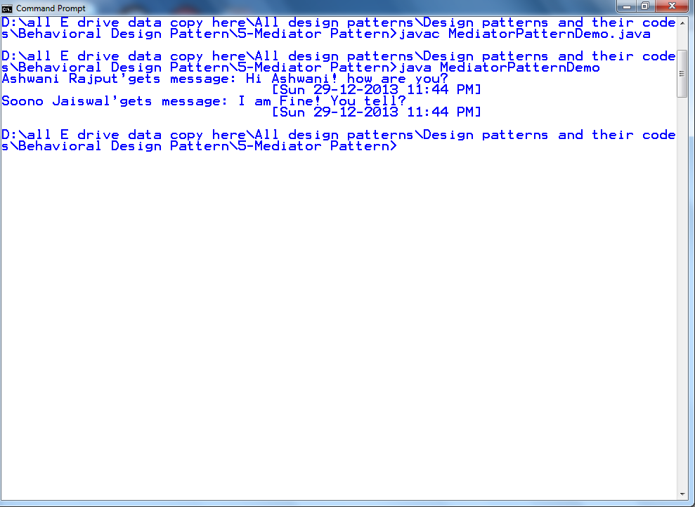

### 3.6 Memento Pattern

A Memento Pattern says that "**to restore the state of an object to its previous state**". But it must do this without violating Encapsulation. Such case is useful in case of error or failure.

The Memento pattern is also known as **Token**.

Undo or backspace or ctrl+z is one of the most used operation in an editor. Memento design pattern is used to implement the undo operation. This is done by saving the current state of the object as it changes state.

#### Benefits:
- It preserves encapsulation boundaries.
- It simplifies the originator.

#### Usage:
- It is used in Undo and Redo operations in most software.
- It is also used in database transactions.

#### UML for Memento Pattern

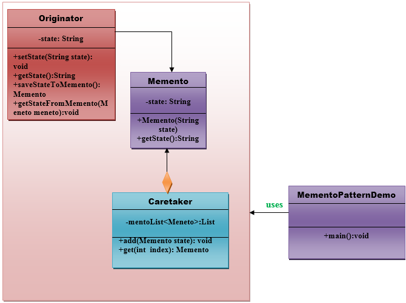

##### Memento:
- Stores internal state of the originator object. The state can include any number of state variables.
- The Memento must have two interfaces, an interface to the caretaker. This interface must not allow any operations or any access to internal state stored by the memento and thus maintains the encapsulation. The other interface is Originator and it allows the Originator to access any state variables necessary to the originator to restore the previous state.
##### Originator:
- Creates a memento object that will capture the internal state of Originator.
- Use the memento object to restore its previous state.
##### Caretaker:
- Responsible for keeping the memento.
- The memento is transparent to the caretaker, and the caretaker must not operate on it.

#### Implementation of Memento Pattern

- Step 1: Create an Originator class that will use Memento object to restore its previous state.

```java
//This is a class.
public class Originator {
    private String state;

    public void setState(String state) {
        this.state = state;
    }

    public String getState() {
        return state;
    }

    public Memento saveStateToMemento() {
        return new Memento(state);
    }

    public void getStateFromMemento(Memento Memento) {
        state = Memento.getState();
    }
}// End of the Originator class.  
```

- Step 2: Create a Memento class that will Store internal state of the Originator object.
```java
//This is a class.  
  
public class Memento {  
      
    private String state;  
  
    public Memento(String state) {  
        this.state=state;  
    }  
    public String getState() {  
        return state;  
    }  
      
}// End of the Memento class. 
```

- Step 3: Create a Caretaker class that will responsible for keeping the Memento.
```java
//This is a class.  
import java.util.ArrayList;  
import java.util.List;  

public class Caretaker {  
      
    private List<Memento> mementoList = new ArrayList<Memento>();  
  
       public void add(Memento state){  
          mementoList.add(state);  
       }  
  
       public Memento get(int index){  
          return mementoList.get(index);  
       }  
  
}// End of the Caretaker class.  
```

- Step 4: Create a MementoPatternDemo class.
```java
//This is a class.  
public class MementoPatternDemo {

    public static void main(String[] args) {

        Originator originator = new Originator();

        Caretaker careTaker = new Caretaker();

        originator.setState("State #1");
        careTaker.add(originator.saveStateToMemento());
        originator.setState("State #2");
        careTaker.add(originator.saveStateToMemento());
        originator.setState("State #3");
        careTaker.add(originator.saveStateToMemento());
        originator.setState("State #4");

        System.out.println("Current State: " + originator.getState());
        originator.getStateFromMemento(careTaker.get(0));
        System.out.println("First saved State: " + originator.getState());
        originator.getStateFromMemento(careTaker.get(1));
        System.out.println("Second saved State: " + originator.getState());
        originator.getStateFromMemento(careTaker.get(2));
        System.out.println("Third saved State: " + originator.getState());
    }

}
// End of the MementoPatternDemo class.  
```

#### [Download this Example](src/MementoPattern.zip)
#### Output

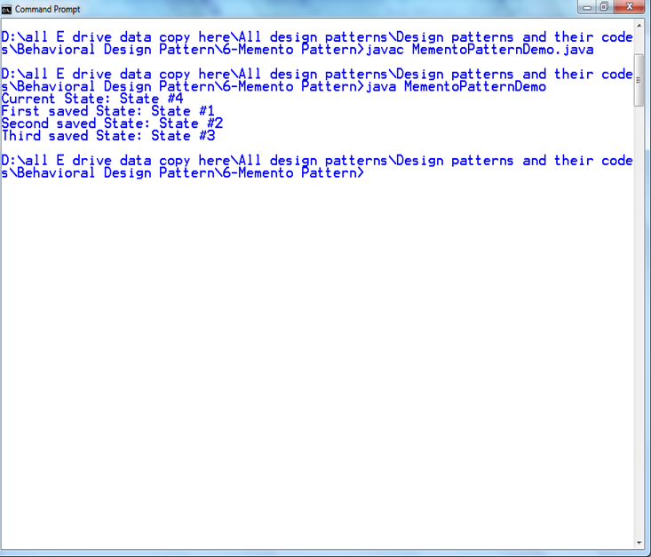


### 3.7 Observer Pattern

An Observer Pattern says that "**just define a one-to-one dependency so that when one object changes state, all its dependents are notified and updated automatically**".

The Memento pattern is also known as **Dependents or Publish-Subscribe**.

#### Benefits:
- It describes the coupling between the objects and the observer.
- It provides the support for broadcast-type communication.

#### Usage:
- When the change of a state in one object must be reflected in another object without keeping the objects tight coupled.
- When the framework we writes and needs to be enhanced in future with new observers with minimal chamges.

#### UML for Observer Pattern

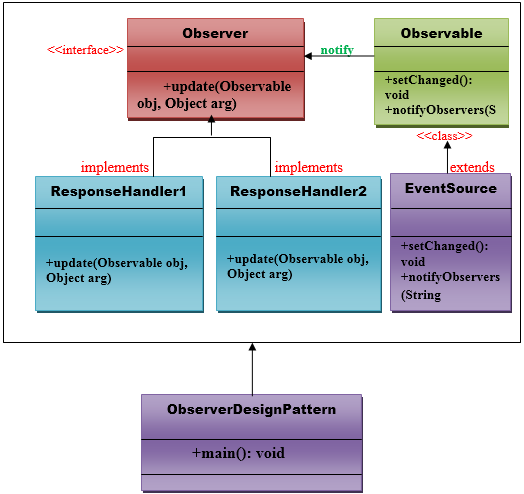

#### Implementation of Observer Pattern

- Step 1: Create a **ResponseHandler1** class the will implement the **java.util.Observer** interface.

```java
//This is a class.  
  
import java.util.Observable;  
import java.util.Observer;  
  
public class ResponseHandler1 implements Observer {  
    private String resp;  
    public void update(Observable obj, Object arg) {  
        if (arg instanceof String) {  
            resp = (String) arg;  
            System.out.println("\nReceived Response: " + resp );  
        }  
    }
}// End of the ResponseHandler1 interface.  
```

- Step 2: Create a **ResponseHandler2** class the will implement the **java.util.Observer** interface.

```java
//This is a class.  
  
import java.util.Observable;  
import java.util.Observer;  
  
public class ResponseHandler2 implements Observer {  
    private String resp;  
    public void update(Observable obj, Object arg) {  
        if (arg instanceof String) {  
            resp = (String) arg;  
            System.out.println("\nReceived Response: " + resp );  
        }  
    }  
}// End of the ResponseHandler2 interface.  
```

- Step 3: Create an **EventSource** class that will extend the **java.util.Observable** class.
```java
//This is a class.  
  
import java.io.BufferedReader;  
import java.io.IOException;  
import java.io.InputStreamReader;  
import java.util.Observable;  
  
public class EventSource extends Observable implements Runnable {  
    @Override  
    public void run() {  
        try {  
            final InputStreamReader isr = new InputStreamReader(System.in);  
            final BufferedReader br = new BufferedReader(isr);  
            while (true) {  
                String response = br.readLine();  
                setChanged();  
                notifyObservers(response);  
            }  
        }  
        catch (IOException e) {  
            e.printStackTrace();  
        }  
    }  
}// End of the Eventsource class. 
```

#### [Download this Example](src/ObserverPattern.zip)

#### Output

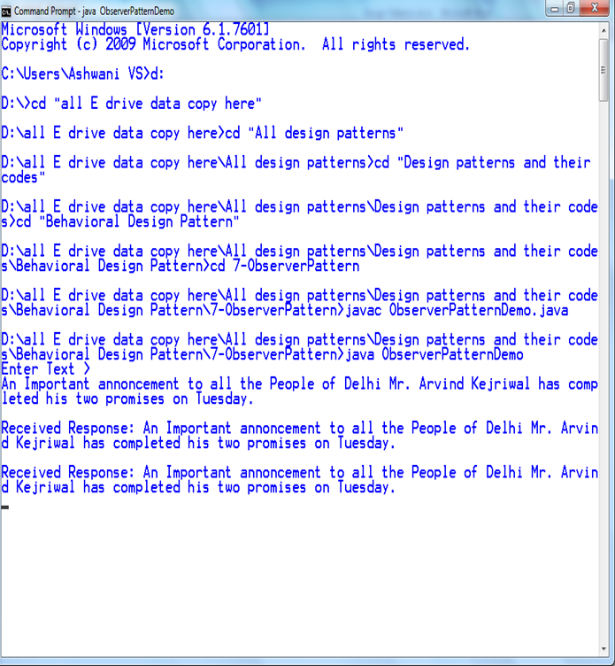


### 3.8 State Pattern

A State Pattern says that "the class behavior changes based on its state". In State Pattern, we create objects which represent various states and a context object whose behavior varies as its state object changes.

The State Pattern is also known as Objects for States.

#### Benefits:
- It keeps the state-specific behavior.
- It makes any state transitions explicit.

#### Usage:
- When the behavior of object depends on its state and it must be able to change its behavior at runtime according to the new state.
- It is used when the operations have large, multipart conditional statements that depend on the state of an object.

#### UML for State Pattern
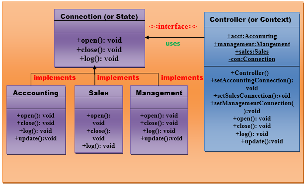


#### Implementation of State Pattern

- Step 1: Create a **Connection** interface that will provide the connection to the Controller class.

```java
//This is an interface.  
public interface Connection {  
  
    public void open();  
    public void close();  
    public void log();  
    public void update();  
}// End of the Connection interface.

```

- Step 2: Create an **Accounting** class that will implement to the Connection interface.
```java
//This is a class.  
public class Accounting implements Connection {

    @Override
    public void open() {
        System.out.println("open database for accounting");
    }

    @Override
    public void close() {
        System.out.println("close the database");
    }

    @Override
    public void log() {
        System.out.println("log activities");
    }

    @Override
    public void update() {
        System.out.println("Accounting has been updated");
    }
}// End of the Accounting class. 
```

- Step 3: Create a Sales class that will implement to the Connection interface.
```java
//This is a class.  
public class Sales implements Connection {

    @Override
    public void open() {
        System.out.println("open database for sales");
    }

    @Override
    public void close() {
        System.out.println("close the database");
    }

    @Override
    public void log() {
        System.out.println("log activities");
    }

    @Override
    public void update() {
        System.out.println("Sales has been updated");
    }

}// End of the Sales class. 
```

- Step 4: Create a Sales class that will implement to the Connection interface.
```java
//This is a class.  

public class Sales implements Connection {

    @Override
    public void open() {
        System.out.println("open database for sales");
    }

    @Override
    public void close() {
        System.out.println("close the database");
    }

    @Override
    public void log() {
        System.out.println("log activities");
    }

    @Override
    public void update() {
        System.out.println("Sales has been updated");
    }
}// End of the Sales class. 
```

- Step 5: Create a Management class that will implement to the Connection interface.
```java
//This is a class.
public class Management implements Connection {

    @Override
    public void open() {
        System.out.println("open database for Management");
    }

    @Override
    public void close() {
        System.out.println("close the database");
    }

    @Override
    public void log() {
        System.out.println("log activities");
    }

    @Override
    public void update() {
        System.out.println("Management has been updated");
    }
}
// End of the Management class.  
```

- Step 6: Create a Controller class that will use the Connection interface for connecting with different types of connection.

```java
//This is a class.  

public class Controller {

    public static Accounting acct;
    public static Sales sales;
    public static Management management;

    private static Connection con;

    Controller() {
        acct = new Accounting();
        sales = new Sales();
        management = new Management();
    }

    public void setAccountingConnection() {
        con = acct;
    }

    public void setSalesConnection() {
        con = sales;
    }

    public void setManagementConnection() {
        con = management;
    }

    public void open() {
        con.open();
    }

    public void close() {
        con.close();
    }

    public void log() {
        con.log();
    }

    public void update() {
        con.update();
    }


}// End of the Controller class.  
```

- Step 7: Create a StatePatternDemo class.
```java
//This is a class.
public class StatePatternDemo {

    Controller controller;

    StatePatternDemo(String con) {
        controller = new Controller();
        //the following trigger should be made by the user  
        if (con.equalsIgnoreCase("management"))
            controller.setManagementConnection();
        if (con.equalsIgnoreCase("sales"))
            controller.setSalesConnection();
        if (con.equalsIgnoreCase("accounting"))
            controller.setAccountingConnection();
        controller.open();
        controller.log();
        controller.close();
        controller.update();
    }

    public static void main(String args[]) {
        new StatePatternDemo(args[0]);
    }
}// End of the StatePatternDemo class.  
```

#### [Download this Example](src/StatePattern.zip)

#### Output
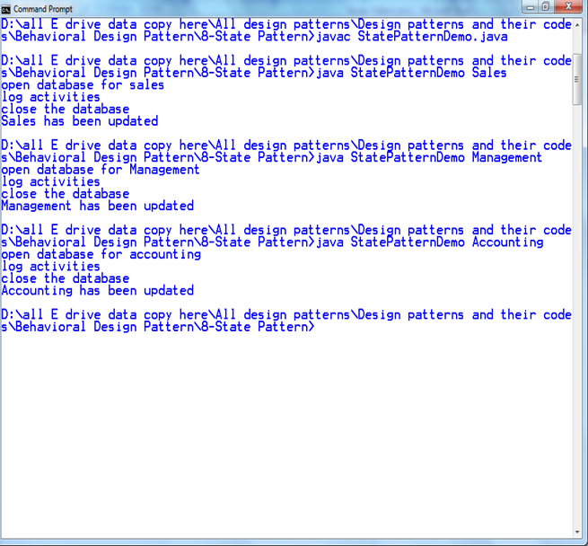

### 3.9 Strategy Pattern

A Strategy Pattern says that "**defines a family of functionality, encapsulate each one, and make them interchangeable**".

The Strategy Pattern is also known as **Policy**.

#### Benefits:
- It provides a substitute to subclassing.
- It defines each behavior within its own class, eliminating the need for conditional statements.
- It makes it easier to extend and incorporate new behavior without changing the application.

#### Usage:
- When the multiple classes differ only in their behaviors.e.g. Servlet API.
- It is used when you need different variations of an algorithm.

#### Strategy Pattern in (Core Java API's) or JSE 7 API's:

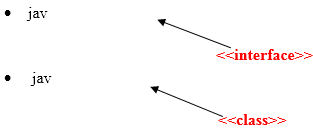

#### Strategy Pattern in (Advance Java API's) or JEE 7 API's:
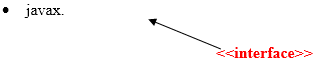

#### UML for Strategy Pattern
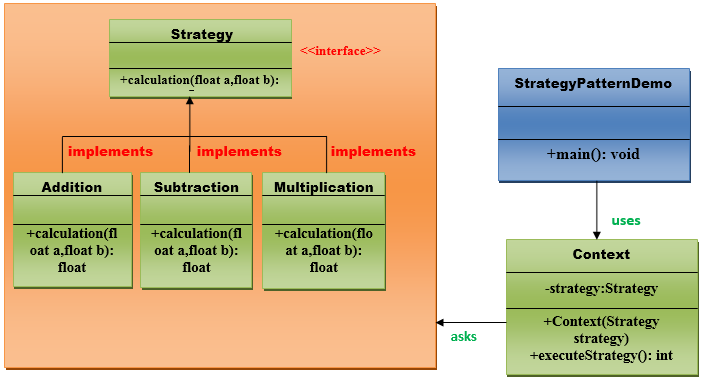

#### Implementation of Strategy Pattern

- Step 1: Create a Strategy interface.
```java
//This is an interface.  
  
public interface Strategy {  
      
    public float calculation(float a, float b);  
  
}// End of the Strategy interface.  
```

- Step 2: Create a Addition class that will implement Startegy interface.
```java
//This is a class.  
public class Addition implements Strategy{  
  
    @Override  
    public float calculation(float a, float b) {  
        return a+b;  
    }  
  
}// End of the Addition class.  
```

- Step 3: Create a Subtraction class that will implement Startegy interface.

```java
//This is a class.  
public class Subtraction  implements Strategy{  
  
    @Override  
    public float calculation(float a, float b) {  
        return a-b;  
    }  
  
}// End of the Subtraction class.
```

- Step 4: Create a Multiplication class that will implement Startegy interface.
```java
//This is a class.  
  
public class Multiplication implements Strategy{  
  
    @Override  
    public float calculation(float a, float b){  
        return a*b;  
    }  
}// End of the Multiplication class. 
```

- Step 5: Create a Context class that will ask from Startegy interface to execute the type of strategy.

```java
//This is a class.  
public class Context {

    private Strategy strategy;

    public Context(Strategy strategy) {
        this.strategy = strategy;
    }

    public float executeStrategy(float num1, float num2) {
        return strategy.calculation(num1, num2);
    }
}// End of the Context class. 
```

- Step 6: Create a StartegyPatternDemo class.
```java
//This is a class.  

import java.io.BufferedReader;
import java.io.IOException;
import java.io.InputStreamReader;

public class StrategyPatternDemo {

    public static void main(String[] args) throws NumberFormatException, IOException {

        BufferedReader br = new BufferedReader(new InputStreamReader(System.in));
        System.out.print("Enter the first value: ");
        float value1 = Float.parseFloat(br.readLine());
        System.out.print("Enter the second value: ");
        float value2 = Float.parseFloat(br.readLine());
        Context context = new Context(new Addition());
        System.out.println("Addition = " + context.executeStrategy(value1, value2));

        context = new Context(new Subtraction());
        System.out.println("Subtraction = " + context.executeStrategy(value1, value2));

        context = new Context(new Multiplication());
        System.out.println("Multiplication = " + context.executeStrategy(value1, value2));
    }

}// End of the StrategyPatternDemo class.
```

#### [Download this Example](src/StrategyPattern.zip)

#### Output
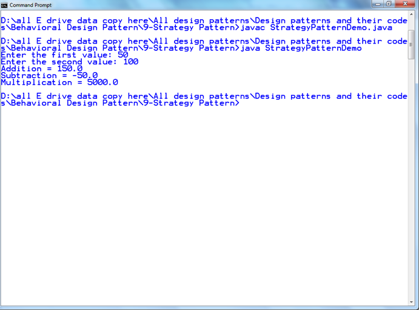


### 3.10 Template Pattern

A Template Pattern says that "**just define the skeleton of a function in an operation, deferring some steps to its subclasses**".

#### Benefits:
- It is very common technique for reusing the code.This is only the main benefit of it.

#### Usage:
- It is used when the common behavior among sub-classes should be moved to a single common class by avoiding the duplication.

#### UML for Template Pattern
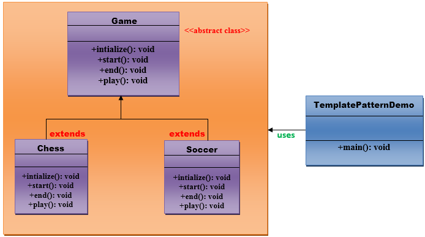

#### Implementation of Template Pattern

- Step 1: Create a Game abstract class.
```java
//This is an abstract class.  
public abstract class Game {

    abstract void initialize();

    abstract void start();

    abstract void end();

    public final void play() {

        //initialize the game  
        initialize();

        //start game  
        start();

        //end game  
        end();
    }
}// End of the Game abstract class.  
```

- Step 2: Create a Chess class that will extend Game abstract class for giving the definition to its method.

```java
//This is a class.  

public class Chess extends Game {
    @Override
    void initialize() {
        System.out.println("Chess Game Initialized! Start playing.");
    }

    @Override
    void start() {
        System.out.println("Game Started. Welcome to in the chess game!");
    }

    @Override
    void end() {
        System.out.println("Game Finished!");
    }
}// End of the Chess class.  
```

- Step 3: Create a Soccer class that will extend Game abstract class for giving the definition to its method.

```java
//This is a class.
public class Soccer extends Game {

    @Override
    void initialize() {
        System.out.println("Soccer Game Initialized! Start playing.");
    }

    @Override
    void start() {
        System.out.println("Game Started. Welcome to in the Soccer game!");
    }

    @Override
    void end() {
        System.out.println("Game Finished!");
    }
}// End of the Soccer class.
```

- Step 4: Create a TemplatePatternDemo class.
```java
//This is a class.  
public class TemplatePatternDemo {

    public static void main(String[] args) throws InstantiationException, IllegalAccessException, ClassNotFoundException {

        Class c = Class.forName(args[0]);
        Game game = (Game) c.newInstance();
        game.play();
    }
}// End of the Soccer class.  
```

#### [Download this Example](src/TemplatePattern.zip)
#### Output


### 3.11 Visitor Pattern

It is a type of behavioral design pattern. It manages algorithms, relationships, and responsibilities between objects. It is used to perform an operation on a group of similar kinds of Objects at runtime. It decouples the operations from an object structure. Using visitor patterns, we can easily add new behaviors to the existing class hierarchy without changing the existing code. Sometimes, it is also known as a behavioral pattern.

These design patterns provide all about class object communication. These are the patterns that are specifically concerned with communication between objects.

Therefore, the primary goal of the visitor pattern is **to moves the operational logic from the objects to another class**. Using visitor patterns, we can achieve the open-close principle. According to the GoF, the visitor design pattern is defined as:

Representing an operation to be performed on elements of an object structure. Visitor lets you define a new operation without changing the classes of the elements on which it operates.

#### The following figure describes the concept of visitor design patterns.

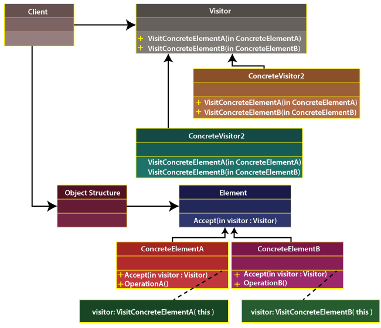

The visitor pattern actually creates an external class that uses data in other classes. We can use the pattern when we need to perform operations across a dispate set of objects. It provides additional functionality to the class without modifying it.

There are the two most important methods that are used in visitor patterns. The accept() method accepts a visitor. It is provided by the Visitable class. The visit() method is called every time when we visit an element. It is implemented by the Visitor class.

#### Example of Visitor Design Pattern

The most common example of visitor pattern is shopping in the supermarket. In the supermarket, we pick the goods and add them to our cart. When we collect all the necessary goods to the cart, we go to the bill desk for billing. The cashier checks all the goods picked by us and tells us the total amount; we have to pay. Here, the cashier acts as a visitor.

#### Where and when to use it?
We should use a visitor design pattern if the application holds the following conditions:

- If we have a well-defined set of classes that are to be visited.
- Operations on said classes are not well-defined or known in advance. For example, if someone is consuming your API and you want to give consumers a way to add new ad-hoc functionality to objects. They're also a convenient way to extend sealed classes with ad-hoc functionality.
- You perform operations of a class of objects and want to avoid run-time type testing. This is usually the case when you traverse a hierarchy of disparate objects having different properties.

#### Design Components
There are five major components of visitor pattern:

- **Client**: It is a class that acts as a consumer of the classes of the design pattern. It has the authority to access the data structure objects. It also instructs them to accept a Visitor that performs the appropriate processing.
- **Visitor**: It may be an interface or an abstract class. The interface contains the visit operation for all types of visitable classes.
- **ConcreteVisitor**: All the visit methods that are declared in abstract visitor must be implemented in the ConcreteVisitor class. Each visitor is responsible for different operations.
- **Visitable**: It is also an interface in which we declare the accepted operation. It is an entry point that enables an object to be visited by the visitor object.
- **ConcreteVisitable**: It is a class that implements the Visitable interface or class in which accept operation is defined. The object of the visitor class is passed through the object of using the accept operation.

#### Advantages
- We can easily add items to the system. The changes are required only in the Visitor interface. Other existing code will not be affected.
- If the logic of operation changes, then we need to make changes only in the visitor implementation.
- It reduces the maintenance cost.
- Being relatively clean, easy-to-read code.
- Type-safety, type errors are caught at compile time.
- It provides high extensibility.

#### Disadvantages
- It is difficult to extend if there are several implementations of the visitor interface.
- While designing the pattern, emphasis on the return type of the visit() method. Else, we will have to change the interface and all its implementations.

#### Implementation of Visitor Design Pattern in Java
Let's design a pattern for the vehicles gone under service and visited by the inspector who calculates the service charge for each vehicle and total service charges including all the vehicles.

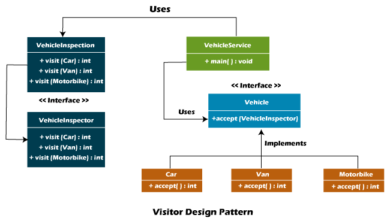

In the following example, first, we will create two interfaces named **Vehicle** and **VehicleInspector**.

- Vehicle.java
```java
public interface Vehicle {  
//every vehicle goes under full service and the vehicle inspector calculates the total service charge   
    int accept(VehicleInspector vehicleInspector);  
}
```

- VehicleInspector.java
```java
//vehicle inspector visits all the vehicle   
public interface VehicleInspector {  
//visits car  
    int visit(Car car);  
//visits van  
    int visit(Van van);  
//visits motor bike  
    int visit(Motorbike motorbike);  
}
```

Here, we will create five Java classes named **Car.java, Van.java, Moterbike.java, VehicleInspection.java, and VehicleService.java**. The classes Car, Van, and Motorbike implements the **Vehicle** interface. These are the vehicles going under maintenance.

- Car.java
```java
//the class implements the Vehicle interface   
public class Car implements Vehicle {
    private String color;
    private int manufactureDate;

    //creating a constructor of the class  
    public Car(String color, int manufactureDate) {
        this.color = color;
        this.manufactureDate = manufactureDate;
    }

    //creating getters and setters  
    public String getColor() {
        return color;
    }

    public void setColor(String color) {
        this.color = color;
    }

    public int getManufactureDate() {
        return manufactureDate;
    }

    public void setManufactureDate(int manufactureDate) {
        this.manufactureDate = manufactureDate;
    }

    //overrides the accept() method of the Vehicle interface  
    @Override
    public int accept(VehicleInspector vehicleInspector) {
        return vehicleInspector.visit(this);
    }
}
```

- Motherbike.java
```java
//the class implements the Vehicle interface   
public class Motorbike implements Vehicle {
    private int engineCapacity;
    private String brand;

    //creating constructor of the class  
    public Motorbike(int engineCapacity, String brand) {
        this.engineCapacity = engineCapacity;
        this.brand = brand;
    }

    //generating getters and setters  
    public int getEngineCapacity() {
        return engineCapacity;
    }

    public void setEngineCapacity(int engineCapacity) {
        this.engineCapacity = engineCapacity;
    }

    public String getBrand() {
        return brand;
    }

    public void setBrand(String brand) {
        this.brand = brand;
    }

    //overrides the accept() method of the Vehicle interface  
    @Override
    public int accept(VehicleInspector vehicleInspector) {
        return vehicleInspector.visit(this);
    }
}
```

- Van.java
```java
//the class implements the Vehicle interface  
public class Van implements Vehicle {
    private int storageCapacity;
    private int numberOfDoors;

    //creating a constructor of the class  
    public Van(int storageCapacity, int numberOfDoors) {
        this.storageCapacity = storageCapacity;
        this.numberOfDoors = numberOfDoors;
    }

    //generating getters and setters  
    public int getStorageCapacity() {
        return storageCapacity;
    }

    public void setStorageCapacity(int storageCapacity) {
        this.storageCapacity = storageCapacity;
    }

    public int getNumberOfDoors() {
        return numberOfDoors;
    }

    public void setNumberOfDoors(int numberOfDoors) {
        this.numberOfDoors = numberOfDoors;
    }

    //overrides the accept() method of the Vehicle interface  
    @Override
    public int accept(VehicleInspector vehicleInspector) {
        return vehicleInspector.visit(this);
    }
}
```

- VehicleInspection.java
```java
//the class implements the VehicleInspector interface
public class VehicleInspection implements VehicleInspector {
    //the method returns the total service charge for car visited by the vehicle inspector
    @Override
    public int visit(Car car) {
        int serviceCharge = 0;
        if (car.getColor() == "Black") {
            serviceCharge += 100;
        } else {
            serviceCharge += 50;
        }
        System.out.println("Service Charge for Car: " + serviceCharge);
        return serviceCharge;
    }

    //overrides the visit() method of the VehicleInspector interface when the inspector visit the vehicle
    //the method returns the total service charge for van visited by the vehicle inspector
    @Override
    public int visit(Van van) {
        int serviceCharge = 0;
        if (van.getNumberOfDoors() > 4) {
            serviceCharge += 500;
        } else {
            serviceCharge += 100;
        }
        System.out.println("Service Charge for Van: " + serviceCharge);
        return serviceCharge;
    }

    //the method returns the total service charge for motorbike visited by the vehicle inspector
    @Override
    public int visit(Motorbike motorbike) {
        int serviceCharge = 0;
        if (motorbike.getEngineCapacity() >= 200) {
            serviceCharge += 200;
        } else {
            serviceCharge += 50;
        }
        System.out.println("Service Charge for Motorbike: " + serviceCharge);
        return serviceCharge;
    }
} 
```

- VehicleService.java
```java
public class VehicleService {
    //returns the total service charge of all the vehicles that are gone under full service  
    private static int calculateTotal(Vehicle[] vehicles) {
        VehicleInspector inspector = new VehicleInspection();
        int total = 0;
        for (Vehicle vehicle : vehicles) {
            total = total + vehicle.accept(inspector);
        }
        return total;
    }

    //driver code  
    public static void main(String[] args) {
        Vehicle[] vehicles = new Vehicle[]{
                new Car("Black", 2010),
                new Van(5000, 6),
                new Motorbike(100, "TVS")
        };
        int totalCost = calculateTotal(vehicles);
        System.out.println("Total Service Charge: " + totalCost);
    }
} 
```

When you create all the interfaces and Java classes, the project directory will look something like the following:
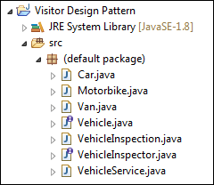

#### [Download Project](src/VisitorDesignPattern.zip)

#### Output:
```java
Service Charge for Car: 100
Service Charge for Van: 500
Service Charge for Motorbike: 50
Total Service Charge: 650
```

`Therefore, the purpose of using visitor patterns is to give all implemented elementary functionalities. It can be used if we required to add infinite numbers of sophisticated functionalities`.


